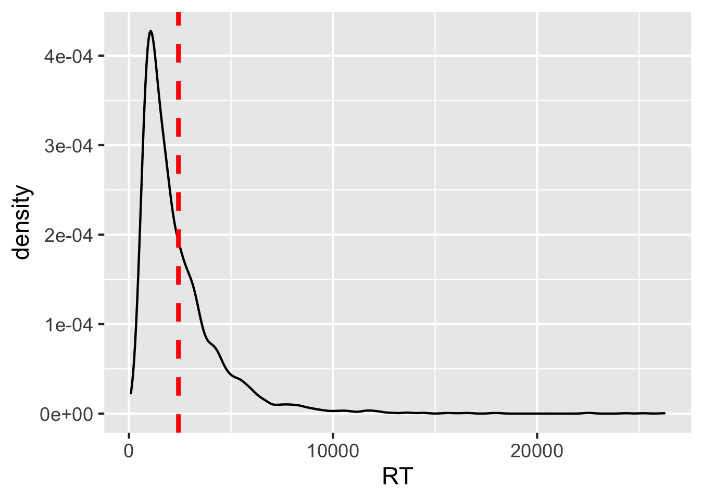
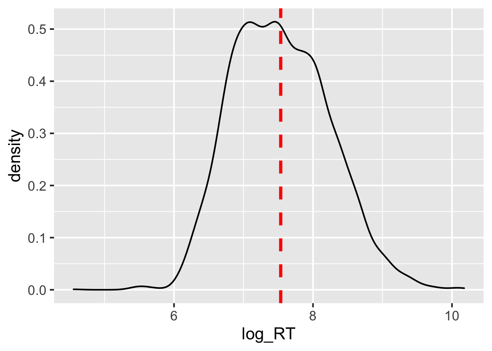
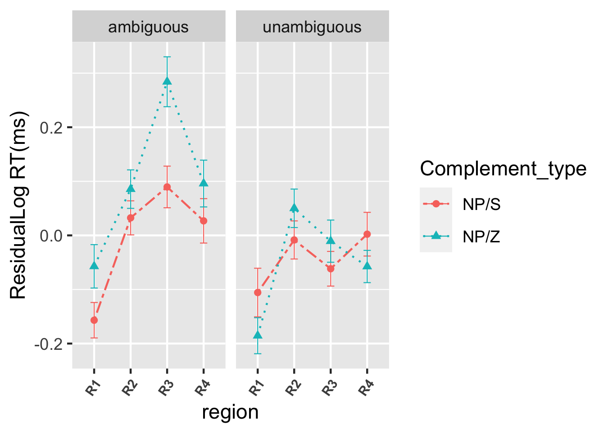
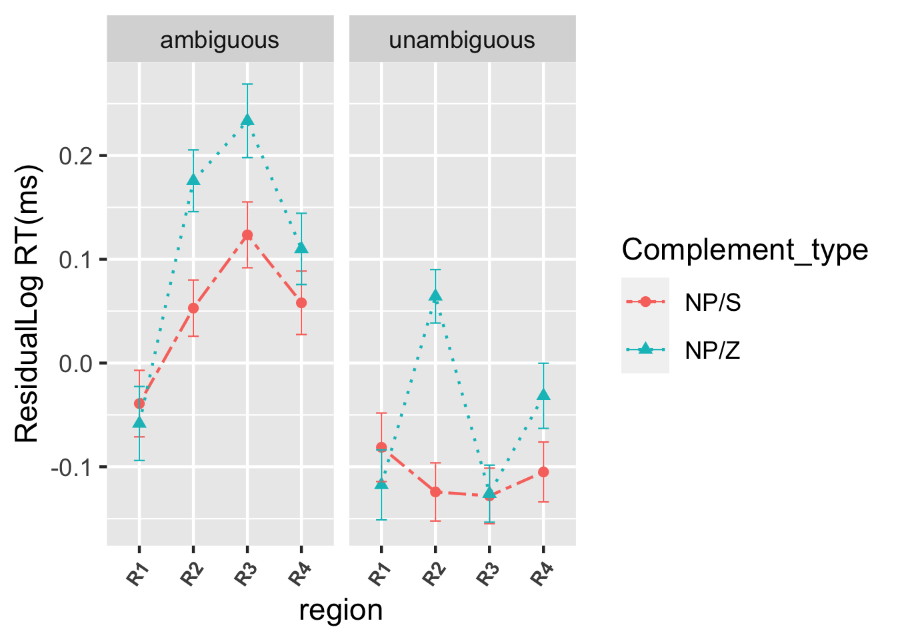
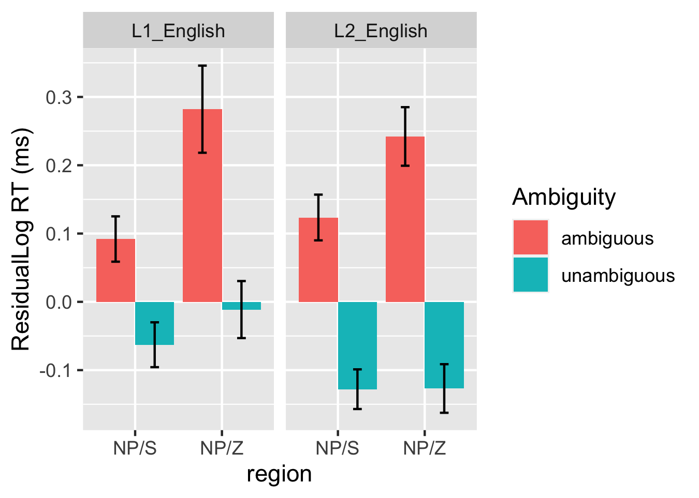
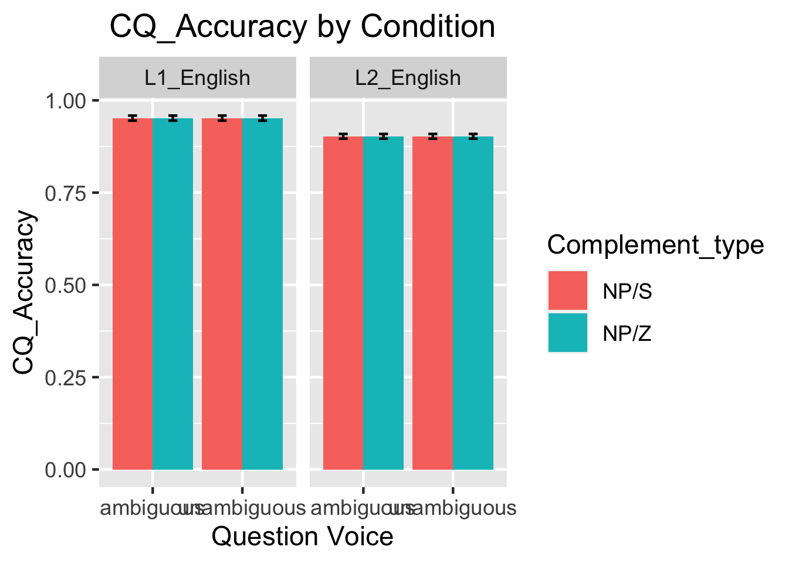
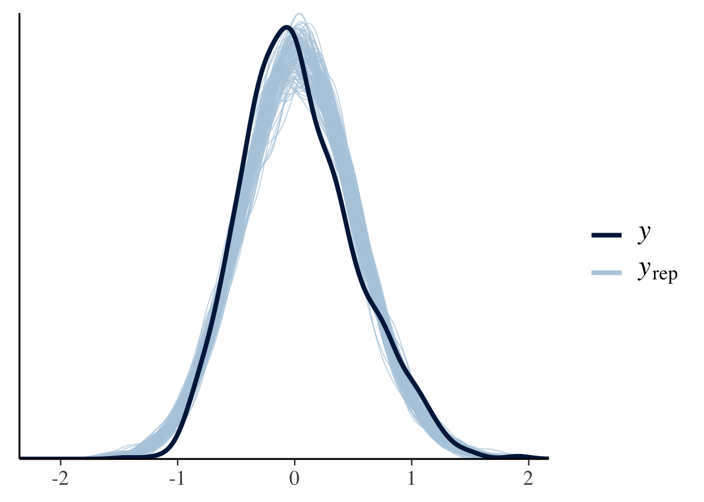
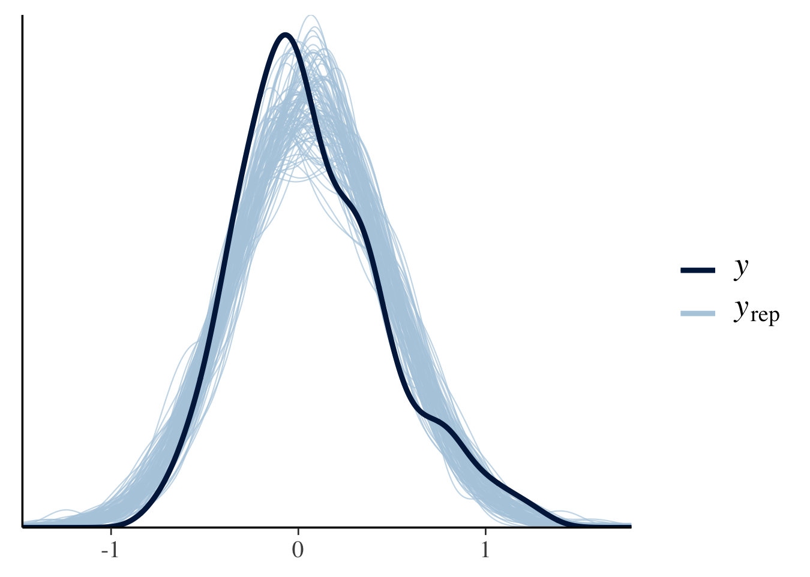
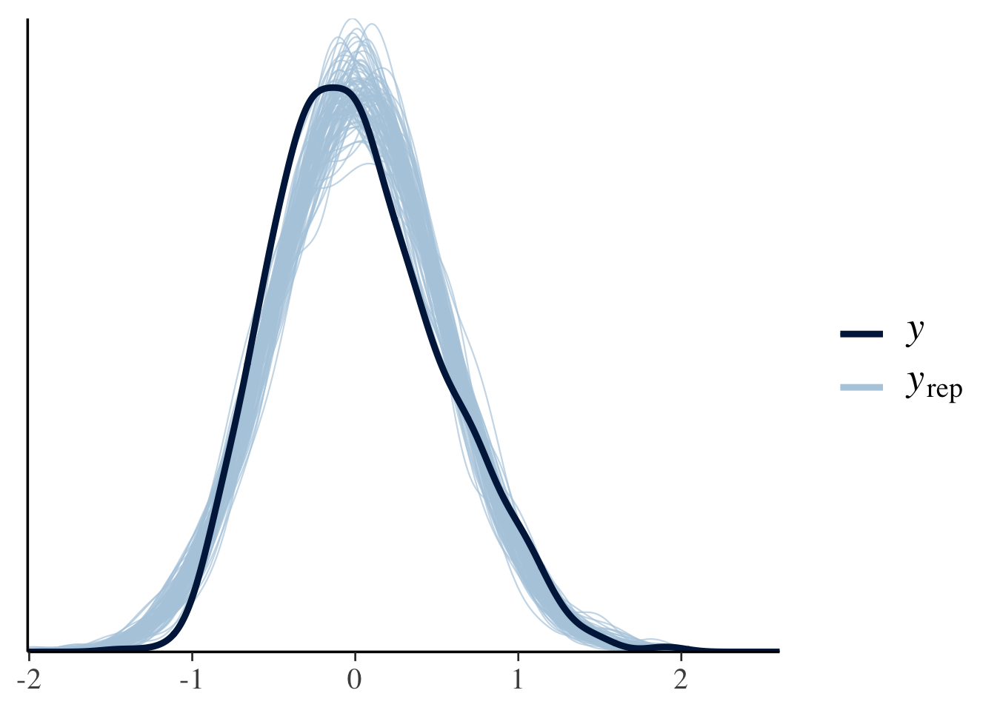

Structural change in L2 sentence processing - SPR
================
Shaohua Fang
Updated December 08 2021

# SPR data - L1

## Read in pre-processed L1 SPR data

``` r
if(file.exists("SPR_L1.csv")){
  SPR_L1 <- read.csv("SPR_L1.csv", strip.white=TRUE, header=T, stringsAsFactors=F)
} 
```

``` r
# how many participants 
length(unique(SPR_L1$name)) # 85 participants
```

    ## [1] 85

``` r
# rename name column to Subject column
names(SPR_L1)[names(SPR_L1) == "name"] <- "Subject"
```

## Extract LexTALE score from AJT

``` r
# Read in AJT data
if(file.exists("AJT_L1.csv")){
  for_LexTALE <- read.csv("AJT_L1.csv", strip.white=TRUE, header=T, stringsAsFactors=F)
}
```

## Join LexTALE score from AJT_L1 to SPR data

``` r
for_LexTALE<- for_LexTALE %>% select(Subject,percent_corr)  # select columns that aim for joining
for_LexTALE <- for_LexTALE %>% distinct(Subject, .keep_all = TRUE)  # remove duplicates by name column
joined_data <- left_join(SPR_L1,for_LexTALE, by="Subject")
```

## Remove participants whose LexTALE score is below 80 - quality screening

``` r
joined_data <- joined_data %>% filter(percent_corr>=80)
```

## Remove participants whose L1 is non-English

``` r
joined_data <- joined_data %>% filter(Language1=="true_english")
length(unique(joined_data$Subject)) # 47 participants left
```

    ## [1] 47

## Delete rows we are not interested in

``` r
joined_data <- droplevels(subset(joined_data, Condition!="consent" & Condition!="background" & Condition!="intro" & Condition!="practice"& Condition!="debrief"))
```

## Deal with comprehension questions - fillers included

``` r
# Exp1 excluded as its CQs are experimentally manipulated 
joined_data <- joined_data %>% filter(!str_detect(Condition,"Monkey-Exp1")) 
```

## Filter comprehension questions

``` r
CQ <- joined_data %>% filter(Controller=='QuestionAlt')
colnames(CQ)[colnames(CQ) == 'word'] <- 'response' # rename word with response
colnames(CQ)[colnames(CQ) == 'RT'] <- 'accuracy' # rename RT with accuracy
CQ$accuracy <- as.numeric(as.character(CQ$accuracy))
```

## Calculate overall accuracy

``` r
# Function to calculate binomial standard error - from Serine et al.(2019)
se.bin <- function(x){
  n.success = sum(na.omit(x)) #x is coded as 1 (success) or 0 (failure), so number of successes is the sum of x = 1 
  n         = length(na.omit(x))
  p         = n.success / n
  return(sqrt(p*(1-p)/n))
}
```

``` r
CQ %>% dplyr::summarize(
  fillerAccuracy = round(100*mean(accuracy, na.rm = TRUE), digits=1), # note that dplyr package and tidyverse package are not compatible for summarize() function
  fillerSE = round(100*se.bin(accuracy), digits=1))  # overall accuracy is 93.7%, SE=0.5%
```

    ##   fillerAccuracy fillerSE
    ## 1           93.7      0.5

## Compute mean accuracy for each participant for the experimental items

``` r
by_subject_accuracy_L1 <- summarySE(CQ, measurevar="accuracy", groupvars=c("Subject"))
```

## Join CQ and SPR_L1 data

``` r
CQ <- by_subject_accuracy_L1 %>% select(Subject,accuracy)
CQ <- CQ %>% distinct(Subject, .keep_all = TRUE)  # remove duplicates by name column
joined_data <- left_join(joined_data,CQ, by="Subject")
```

## Exclude participants with accuracy less than 0.8

``` r
low <- joined_data %>% filter(accuracy<0.8)
length(unique(low$Subject)) # One L1 subjetc whose accuracy lower than 0.8
```

    ## [1] 1

## Remove the one subjetc whose accuracy lower than 0.8

``` r
accurate <- subset(joined_data, !Subject %in% low$Subject) 
length(unique(accurate$Subject)) # 46 subjects left for further studies
```

    ## [1] 46

## Filter data from the remaining data from L1 participants

``` r
CQ_new <- accurate %>% select("Sbjtime","accuracy")
CQ_new$Sbjtime <- as.factor(CQ_new$Sbjtime)
```

## Overall accuracy for the remaining data

``` r
CQ_new %>% dplyr::summarize(
  fillerAccuracy = round(100*mean(accuracy, na.rm = TRUE), digits=1), # note that dplyr package and tidyverse package are not compatible for summarize() function
  fillerSE = round(100*se.bin(accuracy), digits=1)) # the overall accuracy now is 94.3% and SE=0.2%
```

    ##   fillerAccuracy fillerSE
    ## 1           94.3      0.2

## Filter Exp4 for further analysis

``` r
Exp4 <- accurate %>% filter(str_detect(Condition,"Monkey-Exp4"))
```

## Data points with the RTs beyond 2.5 standard deviations from the mean dropped

``` r
Exp4_trimmed <- Exp4 %>% 
  group_by(Subject) %>% 
  filter(abs(RT - mean(RT)) < (sd(RT) * 2.5)) 

round(100*((dim(Exp4)[1]-dim(Exp4_trimmed)[1])/dim(Exp4)[1]), digits=1) # (2.6 % of the data points affected)
```

    ## [1] 2.6

## Get rid of values equal to or below 0, since it’s mathmatically impossible to log them

``` r
Exp4_trimmed  <-  Exp4_trimmed %>% filter(RT>0)
Exp4_trimmed <- droplevels(subset(Exp4_trimmed, Controller!="QuestionAlt"))
```

## Natural lg transform RTs to approach normal distribution

``` r
Exp4_trimmed <- Exp4_trimmed %>% mutate(log_RT=log(RT))
```

## Residualization (to adjust for variability in region length and individual reading speed) on logged data

``` r
Exp4_trimmed$word_length <- nchar(as.character(Exp4_trimmed$word))
Exp4_trimmed$word_length<- as.numeric(Exp4_trimmed$word_length)
mixed_model <- lmer(log_RT ~ scale(word_length) + (1+scale(word_length)|Subject), Exp4_trimmed)
Exp4_trimmed$corrected_log_rt <- residuals(mixed_model)
```

## Split the “Condition” column based on hyphen

``` r
Exp4_trimmed <- Exp4_trimmed %>% separate(Condition, c("X", "Y", "Complement_type","Ambiguity", "Q", "P"), "-")
```

## Data type conversion

``` r
Exp4_trimmed$Complement_type <- as.factor(Exp4_trimmed$Complement_type)
Exp4_trimmed$Ambiguity <- as.factor(Exp4_trimmed$Ambiguity)
```

# SPR data - L2

## Read in pre-processed L2 SPR data

``` r
if(file.exists("SPR_L2.csv")){
  SPR_L2 <- read.csv("SPR_L2.csv", strip.white=TRUE, header=T, stringsAsFactors=F)
} 
```

``` r
length(unique(SPR_L2$name))
```

    ## [1] 135

``` r
# rename name column to Subject column
names(SPR_L2)[names(SPR_L2) == "name"] <- "Subject"
```

## Extract LexTALE score from L2 AJTs

``` r
if(file.exists("AJT_L2.csv")){
  for_LexTALE_L2 <- read.csv("AJT_L2.csv", strip.white=TRUE, header=T, stringsAsFactors=F)
}
```

## Add LexTale info to SPR L2 data

``` r
for_LexTALE_L2<- for_LexTALE_L2 %>% select(Subject,percent_corr)  # select columns that aim for joining
for_LexTALE_L2 <- for_LexTALE_L2 %>% distinct(Subject, .keep_all = TRUE)  # remove duplicates by name column
combined_data <- left_join(SPR_L2,for_LexTALE_L2, by="Subject")
length(unique(combined_data$Subject)) # 135 participants
```

    ## [1] 135

## Centering and standardize percent_corr

``` r
combined_data <- combined_data %>% mutate(cen=center(percent_corr)) %>% mutate(nor=scale(cen))
combined_data$nor <- as.numeric(combined_data$nor)
```

## Delete rows we are not interested in

``` r
combined_data <- droplevels(subset(combined_data, Condition!="consent" & Condition!="background" & Condition!="intro" & Condition!="practice"& Condition!="debrief"))
```

## Deal with comprehension question (with fillers included)

``` r
combined_data <- combined_data %>% filter(!str_detect(Condition,"Monkey-Exp1")) # Exp1 excluded since its CQs are  experimenatlly manipulated. 
```

## Filter comprehension question

``` r
CQ1 <- combined_data %>% filter(Controller=='QuestionAlt')
colnames(CQ1)[colnames(CQ1) == 'word'] <- 'response' # rename word with response
colnames(CQ1)[colnames(CQ1) == 'RT'] <- 'accuracy' # rename RT with accuracy
CQ1$accuracy <- as.numeric(as.character(CQ1$accuracy))
```

## Calculating overall accuracy

``` r
CQ1 %>% dplyr::summarize(
  fillerAccuracy = round(100*mean(accuracy, na.rm = TRUE), digits=1),
  fillerSE = round(100*se.bin(accuracy), digits=1))  # the overall accuracy is 88.8 %, SE=0.4 %
```

    ##   fillerAccuracy fillerSE
    ## 1           88.8      0.4

## Compute mean accuracy for each participant for the experimental items

``` r
by_subject_accuracy_L2 <- summarySE(CQ1, measurevar="accuracy", groupvars=c("Subject"))
```

## Join CQ and SPR_L2 data sets

``` r
CQ1 <- by_subject_accuracy_L2 %>% select(Subject,accuracy)
CQ1 <- CQ1 %>% distinct(Subject, .keep_all = TRUE)  # remove duplicates by name column
combined_data <- left_join(combined_data,CQ1, by="Subject")
```

## Exclude participants with accuracy less than 0.8

``` r
low1 <- combined_data %>% filter(accuracy<0.8)
length(unique(low1$Subject)) #13 people whose accuracy lower than 0.8
```

    ## [1] 13

``` r
accurate1 <- subset(combined_data, !Subject %in% low1 $Subject) 
length(unique(accurate1$Subject)) # 122 people with accuracy larger than 0.8 left for further studies 
```

    ## [1] 122

## filter Subject and Accuracy info from L2

``` r
accurate1 <- subset(combined_data, !Subject %in% low1 $Subject) 
length(unique(accurate1$Subject)) # 122 people with accuracy larger than 0.8 left for further studies 
```

    ## [1] 122

``` r
CQ_new1 <- accurate1 %>% select("Sbjtime","accuracy")
CQ_new1$Sbjtime <- as.factor(CQ_new1$Sbjtime)
```

## Accuracy for the remaining data from L2 participants

``` r
CQ_new1 %>% dplyr::summarize(
  fillerAccuracy = round(100*mean(accuracy, na.rm = TRUE), digits=1), # note that dplyr package and tidyverse package are not compatible for summarize() function
  fillerSE = round(100*se.bin(accuracy), digits=1))
```

    ##   fillerAccuracy fillerSE
    ## 1           90.7      0.2

## Whether accuracies are significantly different between L1 and L2 participants

``` r
## Add columns for Language grouo info
CQ_new$Language <- "L1"
CQ_new1$Language <- "L2"
combined_CQ_new <- rbind(CQ_new,CQ_new1)
combined_CQ_new$Language <- as.factor(combined_CQ_new$Language)

combined_CQ_new <- combined_CQ_new %>% distinct(Sbjtime,.keep_all = T) ## Remove duplicates by Sbjtime column 
res.aov <- aov(accuracy ~ Language, data = combined_CQ_new)
summary(res.aov) # one-way ANOVA testing the difference between L1 and L2 accuracy
```

    ##              Df Sum Sq Mean Sq F value   Pr(>F)    
    ## Language      1 0.0432 0.04320   17.83 3.97e-05 ***
    ## Residuals   166 0.4022 0.00242                     
    ## ---
    ## Signif. codes:  0 '***' 0.001 '**' 0.01 '*' 0.05 '.' 0.1 ' ' 1

## Filter Exp4 for further analysis

``` r
accurate1 <- accurate1 %>% filter(str_detect(Condition,"Monkey-Exp4"))
```

``` r
# data points with RTs beyond 2.5 SDs of the mean were removed
accurate_trimmed1 <- accurate1 %>% 
  group_by(Subject) %>% 
  filter(abs(RT - mean(RT)) < (sd(RT) * 2.5)) 
round(100*((dim(accurate1)[1]-dim(accurate_trimmed1)[1])/dim(accurate1)[1]), digits=1) # (2.5% of the data affected)
```

    ## [1] 2.5

``` r
# RT equal to 0 or lower than 0 is mathmatically impossible 
accurate_trimmed1  <-  accurate_trimmed1 %>% filter(RT>0)
accurate_trimmed1 <- droplevels(subset(accurate_trimmed1, Controller!="QuestionAlt"))
```

## Log transform RT

``` r
accurate_trimmed1 <- accurate_trimmed1 %>% mutate(log_RT=log(RT))
```

## Density plots with means for the raw RTs

``` r
ggplot(accurate_trimmed1, aes(x=RT)) +
    geom_density() +
    geom_vline(aes(xintercept=mean(RT)),   # Ignore NA values for mean
               color="red", linetype="dashed", size=1)
```

<!-- -->

## Density plots with means for the log_RTs - it’s close to normal distribution with the log transformed RTs

``` r
ggplot(accurate_trimmed1, aes(x=log_RT)) +
    geom_density() +
    geom_vline(aes(xintercept=mean(log_RT)),   # Ignore NA values for mean
               color="red", linetype="dashed", size=1)
```

<!-- -->

## Residualization

``` r
accurate_trimmed1$word_length <- nchar(as.character(accurate_trimmed1$word))
accurate_trimmed1$word_length<- as.numeric(accurate_trimmed1$word_length)
mixed_model <- lmer(log_RT ~ scale(word_length) + (1+scale(word_length)|Subject), accurate_trimmed1)
accurate_trimmed1$corrected_log_rt <- residuals(mixed_model)
```

## Split the “condition” column based on hyphen

``` r
accurate_trimmed1 <- accurate_trimmed1 %>% separate(Condition, c("X", "Y", "Complement_type","Ambiguity", "Q", "P"), "-")
accurate_trimmed1$Complement_type <- as.factor(accurate_trimmed1$Complement_type)
accurate_trimmed1$Ambiguity <- as.factor(accurate_trimmed1$Ambiguity)
```

## Add the language group column

``` r
Exp4_trimmed$Language <- 'L1_English'
accurate_trimmed1$Language <- 'L2_English'
```

## Combine L1 and L2 from SPRs

``` r
L1_L2_SPR_bind <- bind_rows(Exp4_trimmed,accurate_trimmed1)
L1_L2_SPR_bind$Language <- as.factor(L1_L2_SPR_bind$Language)
L1_L2_SPR_bind$region <- as.factor(L1_L2_SPR_bind$region)
```

## Line plot for L1

``` r
for_L1_plot <- L1_L2_SPR_bind %>% filter(Language=="L1_English")

Summary_L1 <- for_L1_plot %>% 
  group_by(Complement_type, Ambiguity,region) %>% 
  summarise_at("corrected_log_rt", 
               list(mean = mean, sd = sd, min = min, max = max, length=length))

Summary_L1$se <- Summary_L1$sd / sqrt(Summary_L1$length) 

ggplot(Summary_L1, aes(x=region, y=mean, group=Complement_type, color=Complement_type)) + 
  geom_line(aes(linetype=Complement_type))+
  geom_point(aes(shape=Complement_type))+ geom_errorbar(
    aes(ymin = mean - se, ymax = mean + se),
    width = .2,
    size = 0.25) +
  scale_linetype_manual(values=c("twodash", "dotted", "solid"))+facet_wrap(~Language)+theme(plot.title = element_text(hjust = 0.5))+scale_y_continuous(name="ResidualLog RT(ms)")+
  scale_x_discrete(labels=c("1" = "R1", "2" = "R2",
                            "3" = "R3","4" = "R4"))+
  theme(axis.text.x = element_text(face = "bold", size=7,angle=55,hjust = 1))+facet_grid(~Ambiguity)
```

<!-- -->

## Line plot for L2

``` r
for_L2_plot <- L1_L2_SPR_bind %>% filter(Language=="L2_English")

Summary_L2 <- for_L2_plot %>% 
  group_by(Complement_type, Ambiguity,region) %>% 
  summarise_at("corrected_log_rt", 
               list(mean = mean, sd = sd, min = min, max = max, length=length))

Summary_L2$se <- Summary_L2$sd / sqrt(Summary_L2$length) 

ggplot(Summary_L2, aes(x=region, y=mean, group=Complement_type, color=Complement_type)) + 
  geom_line(aes(linetype=Complement_type))+
  geom_point(aes(shape=Complement_type))+ geom_errorbar(
    aes(ymin = mean - se, ymax = mean + se),
    width = .2,
    size = 0.25) +
  scale_linetype_manual(values=c("twodash", "dotted", "solid"))+facet_wrap(~Language)+theme(plot.title = element_text(hjust = 0.5))+scale_y_continuous(name="ResidualLog RT(ms)")+
  scale_x_discrete(labels=c("1" = "R1", "2" = "R2",
                            "3" = "R3","4" = "R4"))+
  theme(axis.text.x = element_text(face = "bold", size=7,angle=55,hjust = 1))+facet_wrap(~Ambiguity)
```

<!-- -->

## Bar plot for disambiguating region (3)

``` r
# filter region 3 for both groups 
R3 <- L1_L2_SPR_bind %>% filter(region=="3")

CK<- R3 %>% group_by(Ambiguity,Complement_type,region,Language,Subject) %>% summarise_at("corrected_log_rt", list(mean=mean, sd=sd, min=min, max=max), na.rm=TRUE)

CK_St <- summarySE(CK, measurevar="mean", groupvars=c("Ambiguity","Complement_type","Language"), na.rm=T)

ggplot(CK_St, aes(x=Complement_type, y=mean,fill=Ambiguity)) + 
  geom_bar(position=position_dodge(), stat="identity") +
  geom_errorbar(aes(ymin=mean-se, ymax=mean+se),
                width=.2,                    # Width of the error bars
                position=position_dodge(.9))+ 
  xlab("region") + ylab("ResidualLog RT (ms)") + theme(plot.title = element_text(hjust = 0.5))+facet_wrap(~Language)
```

<!-- -->

## Bar plot for CQ accuracy by condition - not very meaningful as CQs have been trimmed already.

``` r
# Error bars represent standard error of the mean over participants
# Compute the mean accuracy by condition and group 
mean_acc_bysubject <- L1_L2_SPR_bind %>% group_by(Language,Ambiguity,Complement_type,Subject) %>% summarise_at("accuracy", list(mean = mean, sd = sd, min = min, max = max))

# Calculate SE of means over subjects
Summary_mean <- summarySE(mean_acc_bysubject, measurevar="mean", groupvars=c("Ambiguity","Complement_type","Language"))

# Error bars represent standard error of the mean over observations
ggplot(Summary_mean, aes(x=Ambiguity, y=mean, fill=Complement_type)) + 
  geom_bar(position=position_dodge(), stat="identity") +
  geom_errorbar(aes(ymin=mean-se, ymax=mean+se),
                width=.2,                    # Width of the error bars
                position=position_dodge(.9))+facet_wrap(~Language) + ggtitle("CQ_Accuracy by Condition") + 
  xlab("Question Voice") + ylab("CQ_Accuracy") + theme(plot.title = element_text(hjust = 0.5))  
```

<!-- -->

## Difference in accuracy by group - native speakers are reliably more accurate than L2 learners

``` r
LL<-lmer(accuracy~ Language+(Language|Item)
               +(1|Subject), control=lmerControl(optimizer="bobyqa"), data=L1_L2_SPR_bind, REML=F)
```

    ## boundary (singular) fit: see ?isSingular

``` r
summary(LL)
```

    ## Linear mixed model fit by maximum likelihood . t-tests use Satterthwaite's
    ##   method [lmerModLmerTest]
    ## Formula: accuracy ~ Language + (Language | Item) + (1 | Subject)
    ##    Data: L1_L2_SPR_bind
    ## Control: lmerControl(optimizer = "bobyqa")
    ## 
    ##       AIC       BIC    logLik  deviance  df.resid 
    ## -163714.8 -163668.5   81864.4 -163728.8      5510 
    ## 
    ## Scaled residuals: 
    ##        Min         1Q     Median         3Q        Max 
    ## -3.146e-06 -1.060e-06 -2.015e-07  8.356e-07  2.413e-06 
    ## 
    ## Random effects:
    ##  Groups   Name               Variance  Std.Dev.  Corr 
    ##  Subject  (Intercept)        4.756e-05 6.896e-03      
    ##  Item     (Intercept)        1.130e-25 3.362e-13      
    ##           LanguageL2_English 2.669e-05 5.166e-03 -0.99
    ##  Residual                    4.520e-15 6.723e-08      
    ## Number of obs: 5517, groups:  Subject, 89; Item, 16
    ## 
    ## Fixed effects:
    ##                     Estimate Std. Error        df t value Pr(>|t|)   
    ## (Intercept)         1.001983   0.001404  0.913423  713.64  0.00155 **
    ## LanguageL2_English -0.113331   0.002089  0.944929  -54.25  0.01448 * 
    ## ---
    ## Signif. codes:  0 '***' 0.001 '**' 0.01 '*' 0.05 '.' 0.1 ' ' 1
    ## 
    ## Correlation of Fixed Effects:
    ##             (Intr)
    ## LnggL2_Engl -0.671
    ## optimizer (bobyqa) convergence code: 0 (OK)
    ## boundary (singular) fit: see ?isSingular

## Regression models for region 3 which is the critical region - big model with group as a two-level factor

``` r
# sum coding to facilitate model interpretation  
contrasts(R3$Ambiguity) <- c(-0.5,0.5)
contrasts(R3$Complement_type) <- c(-0.5,0.5)

# Data type conversion
R3$Subject <- as.factor(R3$Subject)
R3$Item <- as.factor(R3$Item)
```

## Frequentist linear mixed-effects models

``` r
Model_r3<-lmer(corrected_log_rt~ Ambiguity*Complement_type*Language+(1|Item)
               +(1|Subject), control=lmerControl(optimizer="bobyqa"), data=R3, REML=F)

summary(Model_r3)
```

    ## Linear mixed model fit by maximum likelihood . t-tests use Satterthwaite's
    ##   method [lmerModLmerTest]
    ## Formula: corrected_log_rt ~ Ambiguity * Complement_type * Language + (1 |  
    ##     Item) + (1 | Subject)
    ##    Data: R3
    ## Control: lmerControl(optimizer = "bobyqa")
    ## 
    ##      AIC      BIC   logLik deviance df.resid 
    ##   1767.8   1825.5   -872.9   1745.8     1386 
    ## 
    ## Scaled residuals: 
    ##     Min      1Q  Median      3Q     Max 
    ## -3.6357 -0.6713 -0.0746  0.5920  3.9910 
    ## 
    ## Random effects:
    ##  Groups   Name        Variance Std.Dev.
    ##  Subject  (Intercept) 0.004135 0.0643  
    ##  Item     (Intercept) 0.010553 0.1027  
    ##  Residual             0.196702 0.4435  
    ## Number of obs: 1397, groups:  Subject, 89; Item, 16
    ## 
    ## Fixed effects:
    ##                                                  Estimate Std. Error         df
    ## (Intercept)                                       0.07658    0.03692   40.56826
    ## Ambiguity1                                       -0.22682    0.04615 1299.83511
    ## Complement_type1                                  0.12475    0.04610 1298.85354
    ## LanguageL2_English                               -0.05015    0.03097   89.32024
    ## Ambiguity1:Complement_type1                      -0.15356    0.09232 1299.19469
    ## Ambiguity1:LanguageL2_English                    -0.08104    0.05379 1297.55985
    ## Complement_type1:LanguageL2_English              -0.06856    0.05378 1297.55997
    ## Ambiguity1:Complement_type1:LanguageL2_English    0.04307    0.10758 1297.04552
    ##                                                t value Pr(>|t|)    
    ## (Intercept)                                      2.074   0.0445 *  
    ## Ambiguity1                                      -4.914    1e-06 ***
    ## Complement_type1                                 2.706   0.0069 ** 
    ## LanguageL2_English                              -1.620   0.1088    
    ## Ambiguity1:Complement_type1                     -1.663   0.0965 .  
    ## Ambiguity1:LanguageL2_English                   -1.507   0.1322    
    ## Complement_type1:LanguageL2_English             -1.275   0.2027    
    ## Ambiguity1:Complement_type1:LanguageL2_English   0.400   0.6890    
    ## ---
    ## Signif. codes:  0 '***' 0.001 '**' 0.01 '*' 0.05 '.' 0.1 ' ' 1
    ## 
    ## Correlation of Fixed Effects:
    ##             (Intr) Ambgt1 Cmpl_1 LnL2_E Am1:C_1 A1:LL2 C_1:LL
    ## Ambiguity1  -0.012                                           
    ## Cmplmnt_ty1  0.013 -0.014                                    
    ## LnggL2_Engl -0.615  0.015 -0.015                             
    ## Ambgty1:C_1 -0.009  0.020 -0.019  0.011                      
    ## Ambg1:LL2_E  0.011 -0.857  0.012 -0.015 -0.017               
    ## Cmp_1:LL2_E -0.011  0.012 -0.857  0.014  0.017  -0.012       
    ## A1:C_1:LL2_  0.008 -0.017  0.017 -0.010 -0.857   0.016 -0.017

# Models by group for the frequentist modeling

## L1 group

``` r
R3_L1 <- R3 %>%  filter(Language=="L1_English")

# sum coding to facilitate model interpretation  
contrasts(R3_L1$Ambiguity) <- c(-0.5,0.5)
contrasts(R3_L1$Complement_type) <- c(-0.5,0.5)

# modeling
# Note: the random effect structure simplified only when the model converged
Model_R3_L1<-lmer(corrected_log_rt~ Ambiguity*Complement_type+(1|Item)
               , control=lmerControl(optimizer="bobyqa"), data=R3_L1)

summary(Model_R3_L1)
```

    ## Linear mixed model fit by REML. t-tests use Satterthwaite's method [
    ## lmerModLmerTest]
    ## Formula: corrected_log_rt ~ Ambiguity * Complement_type + (1 | Item)
    ##    Data: R3_L1
    ## Control: lmerControl(optimizer = "bobyqa")
    ## 
    ## REML criterion at convergence: 340
    ## 
    ## Scaled residuals: 
    ##      Min       1Q   Median       3Q      Max 
    ## -2.62575 -0.74541 -0.06792  0.56651  3.00075 
    ## 
    ## Random effects:
    ##  Groups   Name        Variance Std.Dev.
    ##  Item     (Intercept) 0.001758 0.04193 
    ##  Residual             0.139288 0.37321 
    ## Number of obs: 371, groups:  Item, 16
    ## 
    ## Fixed effects:
    ##                              Estimate Std. Error        df t value Pr(>|t|)    
    ## (Intercept)                   0.07545    0.02204  15.10322   3.423  0.00374 ** 
    ## Ambiguity1                   -0.22450    0.03883 358.29516  -5.782 1.61e-08 ***
    ## Complement_type1              0.12350    0.03878 352.99656   3.185  0.00158 ** 
    ## Ambiguity1:Complement_type1  -0.14112    0.07766 358.76065  -1.817  0.07003 .  
    ## ---
    ## Signif. codes:  0 '***' 0.001 '**' 0.01 '*' 0.05 '.' 0.1 ' ' 1
    ## 
    ## Correlation of Fixed Effects:
    ##             (Intr) Ambgt1 Cmpl_1
    ## Ambiguity1  -0.017              
    ## Cmplmnt_ty1  0.017 -0.014       
    ## Ambgty1:C_1 -0.012  0.019 -0.019

``` r
emmeans(Model_R3_L1,pairwise~Ambiguity)
```

    ## NOTE: Results may be misleading due to involvement in interactions

    ## $emmeans
    ##  Ambiguity    emmean     SE   df lower.CL upper.CL
    ##  ambiguous    0.1877 0.0296 46.9   0.1281    0.247
    ##  unambiguous -0.0368 0.0292 43.8  -0.0956    0.022
    ## 
    ## Results are averaged over the levels of: Complement_type 
    ## Degrees-of-freedom method: kenward-roger 
    ## Confidence level used: 0.95 
    ## 
    ## $contrasts
    ##  contrast                estimate     SE  df t.ratio p.value
    ##  ambiguous - unambiguous    0.224 0.0389 358   5.774  <.0001
    ## 
    ## Results are averaged over the levels of: Complement_type 
    ## Degrees-of-freedom method: kenward-roger

``` r
emmeans(Model_R3_L1,pairwise~Complement_type)
```

    ## NOTE: Results may be misleading due to involvement in interactions

    ## $emmeans
    ##  Complement_type emmean     SE   df lower.CL upper.CL
    ##  NP/S            0.0137 0.0291 44.4  -0.0449   0.0723
    ##  NP/Z            0.1372 0.0296 47.2   0.0776   0.1968
    ## 
    ## Results are averaged over the levels of: Ambiguity 
    ## Degrees-of-freedom method: kenward-roger 
    ## Confidence level used: 0.95 
    ## 
    ## $contrasts
    ##  contrast        estimate     SE  df t.ratio p.value
    ##  (NP/S) - (NP/Z)   -0.124 0.0388 353  -3.184  0.0016
    ## 
    ## Results are averaged over the levels of: Ambiguity 
    ## Degrees-of-freedom method: kenward-roger

``` r
emmeans(Model_R3_L1,pairwise~Complement_type|Ambiguity)
```

    ## $emmeans
    ## Ambiguity = ambiguous:
    ##  Complement_type  emmean     SE  df lower.CL upper.CL
    ##  NP/S             0.0907 0.0399 129   0.0116   0.1697
    ##  NP/Z             0.2847 0.0412 142   0.2033   0.3662
    ## 
    ## Ambiguity = unambiguous:
    ##  Complement_type  emmean     SE  df lower.CL upper.CL
    ##  NP/S            -0.0633 0.0398 126  -0.1420   0.0154
    ##  NP/Z            -0.0103 0.0400 128  -0.0894   0.0688
    ## 
    ## Degrees-of-freedom method: kenward-roger 
    ## Confidence level used: 0.95 
    ## 
    ## $contrasts
    ## Ambiguity = ambiguous:
    ##  contrast        estimate     SE  df t.ratio p.value
    ##  (NP/S) - (NP/Z)  -0.1941 0.0554 355  -3.501  0.0005
    ## 
    ## Ambiguity = unambiguous:
    ##  contrast        estimate     SE  df t.ratio p.value
    ##  (NP/S) - (NP/Z)  -0.0529 0.0544 357  -0.973  0.3312
    ## 
    ## Degrees-of-freedom method: kenward-roger

## L2 group

``` r
R3_L2 <- R3 %>%  filter(Language=="L2_English")

# sum coding to facilitate model interpretation  
contrasts(R3_L2$Ambiguity) <- c(-0.5,0.5)
contrasts(R3_L2$Complement_type) <- c(-0.5,0.5)

# modeling
Model_R3_L2<-lmer(corrected_log_rt~ Ambiguity*Complement_type*nor+(1|Item)
               +(1|Subject), control=lmerControl(optimizer="bobyqa"), data=R3_L2)

summary(Model_R3_L2)
```

    ## Linear mixed model fit by REML. t-tests use Satterthwaite's method [
    ## lmerModLmerTest]
    ## Formula: corrected_log_rt ~ Ambiguity * Complement_type * nor + (1 | Item) +  
    ##     (1 | Subject)
    ##    Data: R3_L2
    ## Control: lmerControl(optimizer = "bobyqa")
    ## 
    ## REML criterion at convergence: 1410.3
    ## 
    ## Scaled residuals: 
    ##     Min      1Q  Median      3Q     Max 
    ## -3.4997 -0.7076 -0.0518  0.6279  3.7090 
    ## 
    ## Random effects:
    ##  Groups   Name        Variance Std.Dev.
    ##  Subject  (Intercept) 0.004601 0.06783 
    ##  Item     (Intercept) 0.016951 0.13020 
    ##  Residual             0.218739 0.46770 
    ## Number of obs: 1011, groups:  Subject, 64; Item, 16
    ## 
    ## Fixed effects:
    ##                                   Estimate Std. Error         df t value
    ## (Intercept)                       0.019083   0.036781  16.624634   0.519
    ## Ambiguity1                       -0.310151   0.029717 927.570141 -10.437
    ## Complement_type1                  0.059784   0.029705 927.384872   2.013
    ## nor                               0.044484   0.017534  61.787393   2.537
    ## Ambiguity1:Complement_type1      -0.113533   0.059441 927.726821  -1.910
    ## Ambiguity1:nor                    0.002957   0.030559 930.754538   0.097
    ## Complement_type1:nor             -0.003155   0.030577 931.176680  -0.103
    ## Ambiguity1:Complement_type1:nor  -0.013295   0.061168 931.449083  -0.217
    ##                                 Pr(>|t|)    
    ## (Intercept)                       0.6107    
    ## Ambiguity1                        <2e-16 ***
    ## Complement_type1                  0.0444 *  
    ## nor                               0.0137 *  
    ## Ambiguity1:Complement_type1       0.0564 .  
    ## Ambiguity1:nor                    0.9229    
    ## Complement_type1:nor              0.9178    
    ## Ambiguity1:Complement_type1:nor   0.8280    
    ## ---
    ## Signif. codes:  0 '***' 0.001 '**' 0.01 '*' 0.05 '.' 0.1 ' ' 1
    ## 
    ## Correlation of Fixed Effects:
    ##             (Intr) Ambgt1 Cmpl_1 nor    Am1:C_1 Ambg1: Cmp_1:
    ## Ambiguity1  -0.003                                           
    ## Cmplmnt_ty1  0.002 -0.003                                    
    ## nor         -0.061 -0.003  0.001                             
    ## Ambgty1:C_1 -0.001  0.005 -0.008 -0.006                      
    ## Ambigty1:nr -0.001 -0.133 -0.007 -0.007  0.005               
    ## Cmplmnt_t1:  0.001 -0.007 -0.134  0.004 -0.003  -0.001       
    ## Ambgt1:C_1: -0.003 -0.003 -0.003 -0.001 -0.133   0.005 -0.009

``` r
emmeans(Model_R3_L2,pairwise~Ambiguity)
```

    ## NOTE: Results may be misleading due to involvement in interactions

    ## $emmeans
    ##  Ambiguity   emmean     SE   df lower.CL upper.CL
    ##  ambiguous     0.18 0.0396 22.4   0.0976   0.2617
    ##  unambiguous  -0.13 0.0395 22.1  -0.2120  -0.0482
    ## 
    ## Results are averaged over the levels of: Complement_type 
    ## Degrees-of-freedom method: kenward-roger 
    ## Confidence level used: 0.95 
    ## 
    ## $contrasts
    ##  contrast                estimate     SE  df t.ratio p.value
    ##  ambiguous - unambiguous     0.31 0.0295 928  10.517  <.0001
    ## 
    ## Results are averaged over the levels of: Complement_type 
    ## Degrees-of-freedom method: kenward-roger

``` r
emmeans(Model_R3_L2,pairwise~Complement_type)
```

    ## NOTE: Results may be misleading due to involvement in interactions

    ## $emmeans
    ##  Complement_type   emmean     SE   df lower.CL upper.CL
    ##  NP/S            -0.00495 0.0395 22.2  -0.0869    0.077
    ##  NP/Z             0.05444 0.0396 22.3  -0.0276    0.136
    ## 
    ## Results are averaged over the levels of: Ambiguity 
    ## Degrees-of-freedom method: kenward-roger 
    ## Confidence level used: 0.95 
    ## 
    ## $contrasts
    ##  contrast        estimate     SE  df t.ratio p.value
    ##  (NP/S) - (NP/Z)  -0.0594 0.0294 928  -2.017  0.0440
    ## 
    ## Results are averaged over the levels of: Ambiguity 
    ## Degrees-of-freedom method: kenward-roger

``` r
emmeans(Model_R3_L2,pairwise~Complement_type|Ambiguity)
```

    ## NOTE: Results may be misleading due to involvement in interactions

    ## $emmeans
    ## Ambiguity = ambiguous:
    ##  Complement_type emmean     SE   df lower.CL upper.CL
    ##  NP/S             0.121 0.0447 36.2   0.0305   0.2118
    ##  NP/Z             0.238 0.0449 36.8   0.1472   0.3291
    ## 
    ## Ambiguity = unambiguous:
    ##  Complement_type emmean     SE   df lower.CL upper.CL
    ##  NP/S            -0.131 0.0446 35.9  -0.2215  -0.0405
    ##  NP/Z            -0.129 0.0446 35.9  -0.2197  -0.0388
    ## 
    ## Degrees-of-freedom method: kenward-roger 
    ## Confidence level used: 0.95 
    ## 
    ## $contrasts
    ## Ambiguity = ambiguous:
    ##  contrast        estimate     SE  df t.ratio p.value
    ##  (NP/S) - (NP/Z) -0.11699 0.0418 928  -2.797  0.0053
    ## 
    ## Ambiguity = unambiguous:
    ##  contrast        estimate     SE  df t.ratio p.value
    ##  (NP/S) - (NP/Z) -0.00177 0.0415 927  -0.043  0.9660
    ## 
    ## Degrees-of-freedom method: kenward-roger

## Frequentist regression models using lme4 ran into convergence problems when a maximal random-effects structure was adopted - we instead adopted Bayesian linear mixed models advocated by Vasishth et al.(2018).

``` r
Model_r3_baye <- brm(corrected_log_rt~Ambiguity*Complement_type*Language+(Language|Item)
               +(Ambiguity*Complement_type|Subject),
               data=R3,
               warmup=1000,
               iter = 3000,
               chains = 2,
               inits="random",
               cores = 2)
```

    ## Compiling Stan program...

    ## Trying to compile a simple C file

    ## Running /Library/Frameworks/R.framework/Resources/bin/R CMD SHLIB foo.c
    ## clang -mmacosx-version-min=10.13 -I"/Library/Frameworks/R.framework/Resources/include" -DNDEBUG   -I"/Library/Frameworks/R.framework/Versions/4.1/Resources/library/Rcpp/include/"  -I"/Library/Frameworks/R.framework/Versions/4.1/Resources/library/RcppEigen/include/"  -I"/Library/Frameworks/R.framework/Versions/4.1/Resources/library/RcppEigen/include/unsupported"  -I"/Library/Frameworks/R.framework/Versions/4.1/Resources/library/BH/include" -I"/Library/Frameworks/R.framework/Versions/4.1/Resources/library/StanHeaders/include/src/"  -I"/Library/Frameworks/R.framework/Versions/4.1/Resources/library/StanHeaders/include/"  -I"/Library/Frameworks/R.framework/Versions/4.1/Resources/library/RcppParallel/include/"  -I"/Library/Frameworks/R.framework/Versions/4.1/Resources/library/rstan/include" -DEIGEN_NO_DEBUG  -DBOOST_DISABLE_ASSERTS  -DBOOST_PENDING_INTEGER_LOG2_HPP  -DSTAN_THREADS  -DBOOST_NO_AUTO_PTR  -include '/Library/Frameworks/R.framework/Versions/4.1/Resources/library/StanHeaders/include/stan/math/prim/mat/fun/Eigen.hpp'  -D_REENTRANT -DRCPP_PARALLEL_USE_TBB=1   -I/usr/local/include   -fPIC  -Wall -g -O2  -c foo.c -o foo.o
    ## In file included from <built-in>:1:
    ## In file included from /Library/Frameworks/R.framework/Versions/4.1/Resources/library/StanHeaders/include/stan/math/prim/mat/fun/Eigen.hpp:13:
    ## In file included from /Library/Frameworks/R.framework/Versions/4.1/Resources/library/RcppEigen/include/Eigen/Dense:1:
    ## In file included from /Library/Frameworks/R.framework/Versions/4.1/Resources/library/RcppEigen/include/Eigen/Core:88:
    ## /Library/Frameworks/R.framework/Versions/4.1/Resources/library/RcppEigen/include/Eigen/src/Core/util/Macros.h:628:1: error: unknown type name 'namespace'
    ## namespace Eigen {
    ## ^
    ## /Library/Frameworks/R.framework/Versions/4.1/Resources/library/RcppEigen/include/Eigen/src/Core/util/Macros.h:628:16: error: expected ';' after top level declarator
    ## namespace Eigen {
    ##                ^
    ##                ;
    ## In file included from <built-in>:1:
    ## In file included from /Library/Frameworks/R.framework/Versions/4.1/Resources/library/StanHeaders/include/stan/math/prim/mat/fun/Eigen.hpp:13:
    ## In file included from /Library/Frameworks/R.framework/Versions/4.1/Resources/library/RcppEigen/include/Eigen/Dense:1:
    ## /Library/Frameworks/R.framework/Versions/4.1/Resources/library/RcppEigen/include/Eigen/Core:96:10: fatal error: 'complex' file not found
    ## #include <complex>
    ##          ^~~~~~~~~
    ## 3 errors generated.
    ## make: *** [foo.o] Error 1

    ## Start sampling

``` r
summary(Model_r3_baye)
```

    ##  Family: gaussian 
    ##   Links: mu = identity; sigma = identity 
    ## Formula: corrected_log_rt ~ Ambiguity * Complement_type * Language + (Language | Item) + (Ambiguity * Complement_type | Subject) 
    ##    Data: R3 (Number of observations: 1397) 
    ##   Draws: 2 chains, each with iter = 3000; warmup = 1000; thin = 1;
    ##          total post-warmup draws = 4000
    ## 
    ## Group-Level Effects: 
    ## ~Item (Number of levels: 16) 
    ##                                   Estimate Est.Error l-95% CI u-95% CI Rhat
    ## sd(Intercept)                         0.06      0.03     0.01     0.13 1.00
    ## sd(LanguageL2_English)                0.11      0.04     0.04     0.20 1.00
    ## cor(Intercept,LanguageL2_English)     0.39      0.43    -0.55     0.97 1.00
    ##                                   Bulk_ESS Tail_ESS
    ## sd(Intercept)                         1038      764
    ## sd(LanguageL2_English)                 787     1555
    ## cor(Intercept,LanguageL2_English)      598     1066
    ## 
    ## ~Subject (Number of levels: 89) 
    ##                                                   Estimate Est.Error l-95% CI
    ## sd(Intercept)                                         0.08      0.02     0.05
    ## sd(Ambiguity1)                                        0.26      0.03     0.20
    ## sd(Complement_type1)                                  0.16      0.03     0.09
    ## sd(Ambiguity1:Complement_type1)                       0.09      0.06     0.00
    ## cor(Intercept,Ambiguity1)                            -0.46      0.18    -0.79
    ## cor(Intercept,Complement_type1)                       0.72      0.16     0.33
    ## cor(Ambiguity1,Complement_type1)                     -0.23      0.21    -0.62
    ## cor(Intercept,Ambiguity1:Complement_type1)           -0.15      0.39    -0.82
    ## cor(Ambiguity1,Ambiguity1:Complement_type1)           0.20      0.40    -0.66
    ## cor(Complement_type1,Ambiguity1:Complement_type1)    -0.12      0.40    -0.83
    ##                                                   u-95% CI Rhat Bulk_ESS
    ## sd(Intercept)                                         0.12 1.00     1969
    ## sd(Ambiguity1)                                        0.33 1.00     1750
    ## sd(Complement_type1)                                  0.22 1.00     2117
    ## sd(Ambiguity1:Complement_type1)                       0.23 1.00      984
    ## cor(Intercept,Ambiguity1)                            -0.09 1.00      730
    ## cor(Intercept,Complement_type1)                       0.96 1.00     1212
    ## cor(Ambiguity1,Complement_type1)                      0.20 1.00     2116
    ## cor(Intercept,Ambiguity1:Complement_type1)            0.64 1.00     3228
    ## cor(Ambiguity1,Ambiguity1:Complement_type1)           0.85 1.00     3740
    ## cor(Complement_type1,Ambiguity1:Complement_type1)     0.70 1.00     3507
    ##                                                   Tail_ESS
    ## sd(Intercept)                                         2511
    ## sd(Ambiguity1)                                        2563
    ## sd(Complement_type1)                                  2074
    ## sd(Ambiguity1:Complement_type1)                       1458
    ## cor(Intercept,Ambiguity1)                             1307
    ## cor(Intercept,Complement_type1)                       2017
    ## cor(Ambiguity1,Complement_type1)                      2275
    ## cor(Intercept,Ambiguity1:Complement_type1)            2897
    ## cor(Ambiguity1,Ambiguity1:Complement_type1)           2724
    ## cor(Complement_type1,Ambiguity1:Complement_type1)     3200
    ## 
    ## Population-Level Effects: 
    ##                                                Estimate Est.Error l-95% CI
    ## Intercept                                          0.08      0.03     0.01
    ## Ambiguity1                                        -0.23      0.07    -0.36
    ## Complement_type1                                   0.12      0.05     0.02
    ## LanguageL2_English                                -0.05      0.04    -0.13
    ## Ambiguity1:Complement_type1                       -0.15      0.09    -0.33
    ## Ambiguity1:LanguageL2_English                     -0.08      0.08    -0.24
    ## Complement_type1:LanguageL2_English               -0.07      0.06    -0.20
    ## Ambiguity1:Complement_type1:LanguageL2_English     0.03      0.11    -0.18
    ##                                                u-95% CI Rhat Bulk_ESS Tail_ESS
    ## Intercept                                          0.14 1.00     2384     2675
    ## Ambiguity1                                        -0.10 1.00     1467     2223
    ## Complement_type1                                   0.23 1.00     2260     2555
    ## LanguageL2_English                                 0.04 1.00     1969     2342
    ## Ambiguity1:Complement_type1                        0.03 1.00     2614     2895
    ## Ambiguity1:LanguageL2_English                      0.08 1.00     1286     2587
    ## Complement_type1:LanguageL2_English                0.06 1.00     2200     2414
    ## Ambiguity1:Complement_type1:LanguageL2_English     0.24 1.00     2657     2599
    ## 
    ## Family Specific Parameters: 
    ##       Estimate Est.Error l-95% CI u-95% CI Rhat Bulk_ESS Tail_ESS
    ## sigma     0.41      0.01     0.40     0.43 1.00     3700     2751
    ## 
    ## Draws were sampled using sampling(NUTS). For each parameter, Bulk_ESS
    ## and Tail_ESS are effective sample size measures, and Rhat is the potential
    ## scale reduction factor on split chains (at convergence, Rhat = 1).

``` r
#stanplot (Model_r3_baye, type="hist")
pp_check(Model_r3_baye, nsamples = 100) # the observed data are plotted alongside the predicted data generated by the model. The predicted and observed data have similar distributions, and therefore the model has a reasonable fit.
```

    ## Warning: Argument 'nsamples' is deprecated. Please use argument 'ndraws'
    ## instead.

<!-- -->

# Models by group for the frequentist modeling

## L1 group

``` r
R3_L1_baye <- R3 %>% filter(Language=="L1_English")

Model_r3_L1_baye <- brm(corrected_log_rt~Ambiguity*Complement_type+(1|Item)
               +(Ambiguity*Complement_type|Subject),
               data=R3_L1_baye,
               warmup=1000,
               iter = 3000,
               chains = 2,
               inits="random",
               cores = 2)
```

    ## Compiling Stan program...

    ## Trying to compile a simple C file

    ## Running /Library/Frameworks/R.framework/Resources/bin/R CMD SHLIB foo.c
    ## clang -mmacosx-version-min=10.13 -I"/Library/Frameworks/R.framework/Resources/include" -DNDEBUG   -I"/Library/Frameworks/R.framework/Versions/4.1/Resources/library/Rcpp/include/"  -I"/Library/Frameworks/R.framework/Versions/4.1/Resources/library/RcppEigen/include/"  -I"/Library/Frameworks/R.framework/Versions/4.1/Resources/library/RcppEigen/include/unsupported"  -I"/Library/Frameworks/R.framework/Versions/4.1/Resources/library/BH/include" -I"/Library/Frameworks/R.framework/Versions/4.1/Resources/library/StanHeaders/include/src/"  -I"/Library/Frameworks/R.framework/Versions/4.1/Resources/library/StanHeaders/include/"  -I"/Library/Frameworks/R.framework/Versions/4.1/Resources/library/RcppParallel/include/"  -I"/Library/Frameworks/R.framework/Versions/4.1/Resources/library/rstan/include" -DEIGEN_NO_DEBUG  -DBOOST_DISABLE_ASSERTS  -DBOOST_PENDING_INTEGER_LOG2_HPP  -DSTAN_THREADS  -DBOOST_NO_AUTO_PTR  -include '/Library/Frameworks/R.framework/Versions/4.1/Resources/library/StanHeaders/include/stan/math/prim/mat/fun/Eigen.hpp'  -D_REENTRANT -DRCPP_PARALLEL_USE_TBB=1   -I/usr/local/include   -fPIC  -Wall -g -O2  -c foo.c -o foo.o
    ## In file included from <built-in>:1:
    ## In file included from /Library/Frameworks/R.framework/Versions/4.1/Resources/library/StanHeaders/include/stan/math/prim/mat/fun/Eigen.hpp:13:
    ## In file included from /Library/Frameworks/R.framework/Versions/4.1/Resources/library/RcppEigen/include/Eigen/Dense:1:
    ## In file included from /Library/Frameworks/R.framework/Versions/4.1/Resources/library/RcppEigen/include/Eigen/Core:88:
    ## /Library/Frameworks/R.framework/Versions/4.1/Resources/library/RcppEigen/include/Eigen/src/Core/util/Macros.h:628:1: error: unknown type name 'namespace'
    ## namespace Eigen {
    ## ^
    ## /Library/Frameworks/R.framework/Versions/4.1/Resources/library/RcppEigen/include/Eigen/src/Core/util/Macros.h:628:16: error: expected ';' after top level declarator
    ## namespace Eigen {
    ##                ^
    ##                ;
    ## In file included from <built-in>:1:
    ## In file included from /Library/Frameworks/R.framework/Versions/4.1/Resources/library/StanHeaders/include/stan/math/prim/mat/fun/Eigen.hpp:13:
    ## In file included from /Library/Frameworks/R.framework/Versions/4.1/Resources/library/RcppEigen/include/Eigen/Dense:1:
    ## /Library/Frameworks/R.framework/Versions/4.1/Resources/library/RcppEigen/include/Eigen/Core:96:10: fatal error: 'complex' file not found
    ## #include <complex>
    ##          ^~~~~~~~~
    ## 3 errors generated.
    ## make: *** [foo.o] Error 1

    ## Start sampling

``` r
summary(Model_r3_L1_baye)
```

    ##  Family: gaussian 
    ##   Links: mu = identity; sigma = identity 
    ## Formula: corrected_log_rt ~ Ambiguity * Complement_type + (1 | Item) + (Ambiguity * Complement_type | Subject) 
    ##    Data: R3_L1_baye (Number of observations: 371) 
    ##   Draws: 2 chains, each with iter = 3000; warmup = 1000; thin = 1;
    ##          total post-warmup draws = 4000
    ## 
    ## Group-Level Effects: 
    ## ~Item (Number of levels: 16) 
    ##               Estimate Est.Error l-95% CI u-95% CI Rhat Bulk_ESS Tail_ESS
    ## sd(Intercept)     0.05      0.03     0.00     0.12 1.00     1092     1868
    ## 
    ## ~Subject (Number of levels: 24) 
    ##                                                   Estimate Est.Error l-95% CI
    ## sd(Intercept)                                         0.04      0.03     0.00
    ## sd(Ambiguity1)                                        0.18      0.06     0.07
    ## sd(Complement_type1)                                  0.09      0.05     0.01
    ## sd(Ambiguity1:Complement_type1)                       0.28      0.12     0.05
    ## cor(Intercept,Ambiguity1)                            -0.19      0.40    -0.84
    ## cor(Intercept,Complement_type1)                       0.12      0.44    -0.76
    ## cor(Ambiguity1,Complement_type1)                     -0.43      0.38    -0.93
    ## cor(Intercept,Ambiguity1:Complement_type1)           -0.01      0.41    -0.78
    ## cor(Ambiguity1,Ambiguity1:Complement_type1)           0.48      0.32    -0.27
    ## cor(Complement_type1,Ambiguity1:Complement_type1)    -0.23      0.40    -0.87
    ##                                                   u-95% CI Rhat Bulk_ESS
    ## sd(Intercept)                                         0.10 1.00     1651
    ## sd(Ambiguity1)                                        0.30 1.00     1467
    ## sd(Complement_type1)                                  0.20 1.00     1493
    ## sd(Ambiguity1:Complement_type1)                       0.53 1.00     1534
    ## cor(Intercept,Ambiguity1)                             0.66 1.00      807
    ## cor(Intercept,Complement_type1)                       0.86 1.00     1797
    ## cor(Ambiguity1,Complement_type1)                      0.50 1.00     2145
    ## cor(Intercept,Ambiguity1:Complement_type1)            0.74 1.00     1327
    ## cor(Ambiguity1,Ambiguity1:Complement_type1)           0.92 1.00     2326
    ## cor(Complement_type1,Ambiguity1:Complement_type1)     0.63 1.00     1957
    ##                                                   Tail_ESS
    ## sd(Intercept)                                         2013
    ## sd(Ambiguity1)                                        1099
    ## sd(Complement_type1)                                  1368
    ## sd(Ambiguity1:Complement_type1)                       1283
    ## cor(Intercept,Ambiguity1)                             1223
    ## cor(Intercept,Complement_type1)                       2726
    ## cor(Ambiguity1,Complement_type1)                      2343
    ## cor(Intercept,Ambiguity1:Complement_type1)            2522
    ## cor(Ambiguity1,Ambiguity1:Complement_type1)           2078
    ## cor(Complement_type1,Ambiguity1:Complement_type1)     2683
    ## 
    ## Population-Level Effects: 
    ##                             Estimate Est.Error l-95% CI u-95% CI Rhat Bulk_ESS
    ## Intercept                       0.08      0.03     0.02     0.13 1.00     2675
    ## Ambiguity1                     -0.23      0.05    -0.33    -0.12 1.00     2670
    ## Complement_type1                0.13      0.04     0.04     0.21 1.00     4220
    ## Ambiguity1:Complement_type1    -0.15      0.10    -0.34     0.04 1.00     3315
    ##                             Tail_ESS
    ## Intercept                       2249
    ## Ambiguity1                      2936
    ## Complement_type1                3076
    ## Ambiguity1:Complement_type1     2656
    ## 
    ## Family Specific Parameters: 
    ##       Estimate Est.Error l-95% CI u-95% CI Rhat Bulk_ESS Tail_ESS
    ## sigma     0.36      0.01     0.33     0.39 1.00     3018     2910
    ## 
    ## Draws were sampled using sampling(NUTS). For each parameter, Bulk_ESS
    ## and Tail_ESS are effective sample size measures, and Rhat is the potential
    ## scale reduction factor on split chains (at convergence, Rhat = 1).

``` r
pp_check(Model_r3_L1_baye, nsamples = 100)
```

    ## Warning: Argument 'nsamples' is deprecated. Please use argument 'ndraws'
    ## instead.

<!-- -->

## L2 group

``` r
R3_L2_baye <- R3 %>% filter(Language=="L2_English")

Model_r3_L2_baye <- brm(corrected_log_rt~Ambiguity*Complement_type*nor+(1|Item)
               +(Ambiguity*Complement_type|Subject),
               data=R3_L2_baye,
               warmup=1000,
               iter = 3000,
               chains = 2,
               inits="random",
               cores = 2)
```

    ## Warning: Rows containing NAs were excluded from the model.

    ## Compiling Stan program...

    ## Start sampling

``` r
summary(Model_r3_L2_baye)
```

    ##  Family: gaussian 
    ##   Links: mu = identity; sigma = identity 
    ## Formula: corrected_log_rt ~ Ambiguity * Complement_type * nor + (1 | Item) + (Ambiguity * Complement_type | Subject) 
    ##    Data: R3_L2_baye (Number of observations: 1011) 
    ##   Draws: 2 chains, each with iter = 3000; warmup = 1000; thin = 1;
    ##          total post-warmup draws = 4000
    ## 
    ## Group-Level Effects: 
    ## ~Item (Number of levels: 16) 
    ##               Estimate Est.Error l-95% CI u-95% CI Rhat Bulk_ESS Tail_ESS
    ## sd(Intercept)     0.15      0.03     0.10     0.23 1.00     1023     1701
    ## 
    ## ~Subject (Number of levels: 64) 
    ##                                                   Estimate Est.Error l-95% CI
    ## sd(Intercept)                                         0.09      0.02     0.06
    ## sd(Ambiguity1)                                        0.30      0.04     0.22
    ## sd(Complement_type1)                                  0.20      0.04     0.12
    ## sd(Ambiguity1:Complement_type1)                       0.09      0.06     0.00
    ## cor(Intercept,Ambiguity1)                            -0.44      0.20    -0.79
    ## cor(Intercept,Complement_type1)                       0.69      0.18     0.27
    ## cor(Ambiguity1,Complement_type1)                     -0.06      0.22    -0.48
    ## cor(Intercept,Ambiguity1:Complement_type1)           -0.10      0.42    -0.81
    ## cor(Ambiguity1,Ambiguity1:Complement_type1)           0.02      0.41    -0.78
    ## cor(Complement_type1,Ambiguity1:Complement_type1)    -0.06      0.42    -0.81
    ##                                                   u-95% CI Rhat Bulk_ESS
    ## sd(Intercept)                                         0.13 1.00     1633
    ## sd(Ambiguity1)                                        0.40 1.00     1703
    ## sd(Complement_type1)                                  0.28 1.00     2032
    ## sd(Ambiguity1:Complement_type1)                       0.24 1.00     1512
    ## cor(Intercept,Ambiguity1)                            -0.00 1.01      565
    ## cor(Intercept,Complement_type1)                       0.94 1.01      771
    ## cor(Ambiguity1,Complement_type1)                      0.38 1.00     2148
    ## cor(Intercept,Ambiguity1:Complement_type1)            0.74 1.00     3106
    ## cor(Ambiguity1,Ambiguity1:Complement_type1)           0.78 1.00     3555
    ## cor(Complement_type1,Ambiguity1:Complement_type1)     0.75 1.00     3471
    ##                                                   Tail_ESS
    ## sd(Intercept)                                         1497
    ## sd(Ambiguity1)                                        1940
    ## sd(Complement_type1)                                  2583
    ## sd(Ambiguity1:Complement_type1)                       2229
    ## cor(Intercept,Ambiguity1)                              780
    ## cor(Intercept,Complement_type1)                        909
    ## cor(Ambiguity1,Complement_type1)                      2825
    ## cor(Intercept,Ambiguity1:Complement_type1)            2580
    ## cor(Ambiguity1,Ambiguity1:Complement_type1)           2842
    ## cor(Complement_type1,Ambiguity1:Complement_type1)     2977
    ## 
    ## Population-Level Effects: 
    ##                                 Estimate Est.Error l-95% CI u-95% CI Rhat
    ## Intercept                           0.02      0.04    -0.07     0.10 1.00
    ## Ambiguity1                         -0.31      0.05    -0.41    -0.22 1.00
    ## Complement_type1                    0.06      0.04    -0.01     0.14 1.00
    ## nor                                 0.04      0.02     0.01     0.08 1.00
    ## Ambiguity1:Complement_type1        -0.12      0.06    -0.23    -0.01 1.00
    ## Ambiguity1:nor                      0.00      0.05    -0.09     0.10 1.00
    ## Complement_type1:nor               -0.00      0.04    -0.08     0.07 1.00
    ## Ambiguity1:Complement_type1:nor    -0.01      0.06    -0.13     0.10 1.00
    ##                                 Bulk_ESS Tail_ESS
    ## Intercept                            695     1205
    ## Ambiguity1                          1477     2286
    ## Complement_type1                    2014     2795
    ## nor                                 1805     2741
    ## Ambiguity1:Complement_type1         4287     2933
    ## Ambiguity1:nor                      1507     2041
    ## Complement_type1:nor                1782     2178
    ## Ambiguity1:Complement_type1:nor     4179     2995
    ## 
    ## Family Specific Parameters: 
    ##       Estimate Est.Error l-95% CI u-95% CI Rhat Bulk_ESS Tail_ESS
    ## sigma     0.43      0.01     0.41     0.45 1.00     3066     2931
    ## 
    ## Draws were sampled using sampling(NUTS). For each parameter, Bulk_ESS
    ## and Tail_ESS are effective sample size measures, and Rhat is the potential
    ## scale reduction factor on split chains (at convergence, Rhat = 1).

``` r
pp_check(Model_r3_L2_baye, nsamples = 100)
```

    ## Warning: Argument 'nsamples' is deprecated. Please use argument 'ndraws'
    ## instead.

<!-- -->

## This is how to anonymize participants

``` r
anoymize <- L1_L2_SPR_bind[1:1000,]

anoymize$Subject <- as.factor(anoymize$Subject)

#anoymize <- anoymize %>% 
  #count(Subject, sort = TRUE) %>% 
  #pull(Subject) %>% 
  #as.numeric(Subject)

anoymize$Subject <- as.numeric(anoymize$Subject)
```

## Filter a sample of data from SPR for the project for ‘Data Science’ class

``` r
# Filter the first 1000 rows of the data
nrow(L1_L2_SPR_bind)
```

    ## [1] 5517

``` r
Sample <- L1_L2_SPR_bind[1:1000,]

# Anoymize the subjects 

Sample$Subject <- as.factor(Sample$Subject)
Sample$Subject <- as.numeric(Sample$Subject)
Sample$Subject <- as.factor(Sample$Subject)

1000/5517
```

    ## [1] 0.1812579

``` r
# Read out this sample in csv. 
write.csv(Sample,"SPR_Sample_for_DS_class.csv", row.names = FALSE)
```
