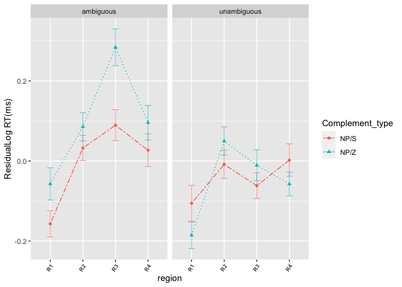
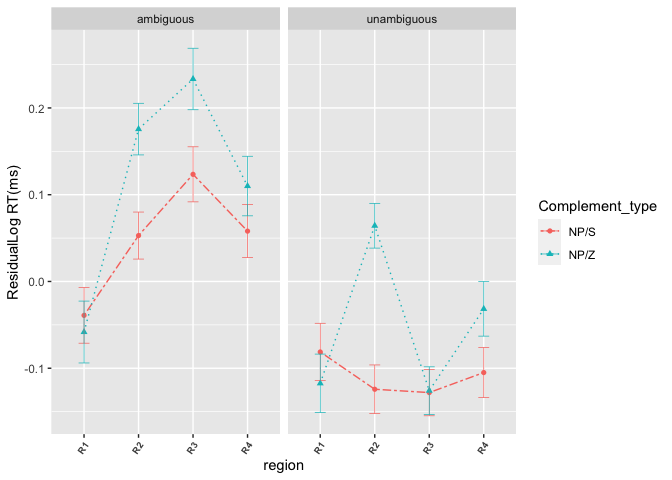
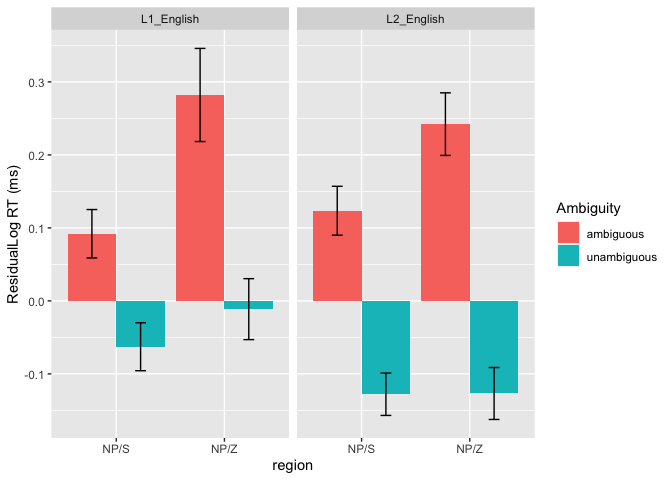
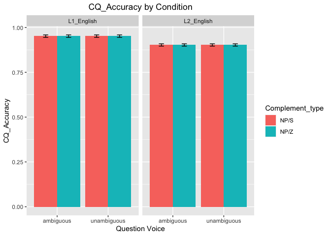
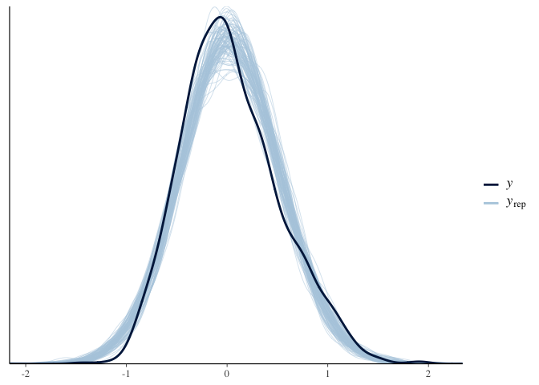

Structural change in L2 sentence processing - SPR
================
Shaohua Fang
27 Oct 2021

# SPR data - L1

## Read in pre-processed L1 SPR data

``` r
if(file.exists("SPR_L1.csv")){
  SPR_L1 <- read.csv("SPR_L1.csv", strip.white=TRUE, header=T, stringsAsFactors=F)
} 
```

``` r
# how many participants 
length(unique(SPR_L1$name)) # 85 participants
```

    ## [1] 85

``` r
# rename name column to Subject column
names(SPR_L1)[names(SPR_L1) == "name"] <- "Subject"
```

## Extract LexTALE score from AJT

``` r
# Read in AJT data
if(file.exists("AJT_L1.csv")){
  for_LexTALE <- read.csv("AJT_L1.csv", strip.white=TRUE, header=T, stringsAsFactors=F)
}
```

## Join LexTALE score from AJT_L1 to SPR data

``` r
for_LexTALE<- for_LexTALE %>% select(Subject,percent_corr)  # select columns that aim for joining
for_LexTALE <- for_LexTALE %>% distinct(Subject, .keep_all = TRUE)  # remove duplicates by name column
joined_data <- left_join(SPR_L1,for_LexTALE, by="Subject")
```

## Remove participants whose LexTALE score is below 80 - quality screening

``` r
joined_data <- joined_data %>% filter(percent_corr>=80)
```

## Remove participants whose L1 is non-English

``` r
joined_data <- joined_data %>% filter(Language1=="true_english")
length(unique(joined_data$Subject)) # 47 participants left
```

    ## [1] 47

## Delete rows we are not interested in

``` r
joined_data <- droplevels(subset(joined_data, Condition!="consent" & Condition!="background" & Condition!="intro" & Condition!="practice"& Condition!="debrief"))
```

## Deal with comprehension questions - fillers included

``` r
# Exp1 excluded as its CQs are experimentally manipulated 
joined_data <- joined_data %>% filter(!str_detect(Condition,"Monkey-Exp1")) 
```

## Filter comprehension questions

``` r
CQ <- joined_data %>% filter(Controller=='QuestionAlt')
colnames(CQ)[colnames(CQ) == 'word'] <- 'response' # rename word with response
colnames(CQ)[colnames(CQ) == 'RT'] <- 'accuracy' # rename RT with accuracy
CQ$accuracy <- as.numeric(as.character(CQ$accuracy))
```

## Calculate overall accuracy

``` r
# Function to calculate binomial standard error - from Serine et al.(2019)
se.bin <- function(x){
  n.success = sum(na.omit(x)) #x is coded as 1 (success) or 0 (failure), so number of successes is the sum of x = 1 
  n         = length(na.omit(x))
  p         = n.success / n
  return(sqrt(p*(1-p)/n))
}
```

``` r
CQ %>% dplyr::summarize(
  fillerAccuracy = round(100*mean(accuracy, na.rm = TRUE), digits=1), # note that dplyr package and tidyverse package are not compatible for summarize() function
  fillerSE = round(100*se.bin(accuracy), digits=1))  # overall accuracy is 93.7%, SE=0.5%
```

    ##   fillerAccuracy fillerSE
    ## 1           93.7      0.5

## Compute mean accuracy for each participant for the experimental items

``` r
by_subject_accuracy_L1 <- summarySE(CQ, measurevar="accuracy", groupvars=c("Subject"))
```

## Join CQ and SPR_L1 data

``` r
CQ <- by_subject_accuracy_L1 %>% select(Subject,accuracy)
CQ <- CQ %>% distinct(Subject, .keep_all = TRUE)  # remove duplicates by name column
joined_data <- left_join(joined_data,CQ, by="Subject")
```

## Exclude participants with accuracy less than 0.8

``` r
low <- joined_data %>% filter(accuracy<0.8)
length(unique(low$Subject)) # One L1 subjetc whose accuracy lower than 0.8
```

    ## [1] 1

## Remove the one subjetc whose accuracy lower than 0.8

``` r
accurate <- subset(joined_data, !Subject %in% low$Subject) 
length(unique(accurate$Subject)) # 46 subjects left for further studies
```

    ## [1] 46

## Filter data from the remaining data from L1 participants

``` r
CQ_new <- accurate %>% select("Sbjtime","accuracy")
CQ_new$Sbjtime <- as.factor(CQ_new$Sbjtime)
```

## Overall accuracy for the remaining data

``` r
CQ_new %>% dplyr::summarize(
  fillerAccuracy = round(100*mean(accuracy, na.rm = TRUE), digits=1), # note that dplyr package and tidyverse package are not compatible for summarize() function
  fillerSE = round(100*se.bin(accuracy), digits=1)) # the overall accuracy now is 94.3% and SE=0.2%
```

    ##   fillerAccuracy fillerSE
    ## 1           94.3      0.2

## Filter Exp4 for further analysis

``` r
Exp4 <- accurate %>% filter(str_detect(Condition,"Monkey-Exp4"))
```

## Data points with the RTs beyond 2.5 standard deviations from the mean dropped

``` r
Exp4_trimmed <- Exp4 %>% 
  group_by(Subject) %>% 
  filter(abs(RT - mean(RT)) < (sd(RT) * 2.5)) 

round(100*((dim(Exp4)[1]-dim(Exp4_trimmed)[1])/dim(Exp4)[1]), digits=1) # (2.6 % of the data points affected)
```

    ## [1] 2.6

## Get rid of values equal to or below 0, since it’s mathmatically impossible to log them

``` r
Exp4_trimmed  <-  Exp4_trimmed %>% filter(RT>0)
Exp4_trimmed <- droplevels(subset(Exp4_trimmed, Controller!="QuestionAlt"))
```

## Natural lg transform RTs to approach normal distribution

``` r
Exp4_trimmed <- Exp4_trimmed %>% mutate(log_RT=log(RT))
```

## Residualization (to adjust for variability in region length and individual reading speed) on logged data

``` r
Exp4_trimmed$word_length <- nchar(as.character(Exp4_trimmed$word))
Exp4_trimmed$word_length<- as.numeric(Exp4_trimmed$word_length)
mixed_model <- lmer(log_RT ~ scale(word_length) + (1+scale(word_length)|Subject), Exp4_trimmed)
Exp4_trimmed$corrected_log_rt <- residuals(mixed_model)
```

## Split the “Condition” column based on hyphen

``` r
Exp4_trimmed <- Exp4_trimmed %>% separate(Condition, c("X", "Y", "Complement_type","Ambiguity", "Q", "P"), "-")
```

## Data type conversion

``` r
Exp4_trimmed$Complement_type <- as.factor(Exp4_trimmed$Complement_type)
Exp4_trimmed$Ambiguity <- as.factor(Exp4_trimmed$Ambiguity)
```

# SPR data - L2

## Read in pre-processed L2 SPR data

``` r
if(file.exists("SPR_L2.csv")){
  SPR_L2 <- read.csv("SPR_L2.csv", strip.white=TRUE, header=T, stringsAsFactors=F)
} 
```

``` r
length(unique(SPR_L2$name))
```

    ## [1] 135

``` r
# rename name column to Subject column
names(SPR_L2)[names(SPR_L2) == "name"] <- "Subject"
```

## Extract LexTALE score from L2 AJTs

``` r
if(file.exists("AJT_L2.csv")){
  for_LexTALE_L2 <- read.csv("AJT_L2.csv", strip.white=TRUE, header=T, stringsAsFactors=F)
}
```

## Add LexTale info to SPR L2 data

``` r
for_LexTALE_L2<- for_LexTALE_L2 %>% select(Subject,percent_corr)  # select columns that aim for joining
for_LexTALE_L2 <- for_LexTALE_L2 %>% distinct(Subject, .keep_all = TRUE)  # remove duplicates by name column
combined_data <- left_join(SPR_L2,for_LexTALE_L2, by="Subject")
length(unique(combined_data$Subject)) # 135 participants
```

    ## [1] 135

## Centering and standardize percent_corr

``` r
combined_data <- combined_data %>% mutate(cen=center(percent_corr)) %>% mutate(nor=scale(cen))
combined_data$nor <- as.numeric(combined_data$nor)
```

## Delete rows we are not interested in

``` r
combined_data <- droplevels(subset(combined_data, Condition!="consent" & Condition!="background" & Condition!="intro" & Condition!="practice"& Condition!="debrief"))
```

## Deal with comprehension question (with fillers included)

``` r
combined_data <- combined_data %>% filter(!str_detect(Condition,"Monkey-Exp1")) # Exp1 excluded since its CQs are  experimenatlly manipulated. 
```

## Filter comprehension question

``` r
CQ1 <- combined_data %>% filter(Controller=='QuestionAlt')
colnames(CQ1)[colnames(CQ1) == 'word'] <- 'response' # rename word with response
colnames(CQ1)[colnames(CQ1) == 'RT'] <- 'accuracy' # rename RT with accuracy
CQ1$accuracy <- as.numeric(as.character(CQ1$accuracy))
```

## Calculating overall accuracy

``` r
CQ1 %>% dplyr::summarize(
  fillerAccuracy = round(100*mean(accuracy, na.rm = TRUE), digits=1),
  fillerSE = round(100*se.bin(accuracy), digits=1))  # the overall accuracy is 88.8 %, SE=0.4 %
```

    ##   fillerAccuracy fillerSE
    ## 1           88.8      0.4

## Compute mean accuracy for each participant for the experimental items

``` r
by_subject_accuracy_L2 <- summarySE(CQ1, measurevar="accuracy", groupvars=c("Subject"))
```

## Join CQ and SPR_L2 data sets

``` r
CQ1 <- by_subject_accuracy_L2 %>% select(Subject,accuracy)
CQ1 <- CQ1 %>% distinct(Subject, .keep_all = TRUE)  # remove duplicates by name column
combined_data <- left_join(combined_data,CQ1, by="Subject")
```

## Exclude participants with accuracy less than 0.8

``` r
low1 <- combined_data %>% filter(accuracy<0.8)
length(unique(low1$Subject)) #13 people whose accuracy lower than 0.8
```

    ## [1] 13

``` r
accurate1 <- subset(combined_data, !Subject %in% low1 $Subject) 
length(unique(accurate1$Subject)) # 122 people with accuracy larger than 0.8 left for further studies 
```

    ## [1] 122

## filter Subject and Accuracy info from L2

``` r
accurate1 <- subset(combined_data, !Subject %in% low1 $Subject) 
length(unique(accurate1$Subject)) # 122 people with accuracy larger than 0.8 left for further studies 
```

    ## [1] 122

``` r
CQ_new1 <- accurate1 %>% select("Sbjtime","accuracy")
CQ_new1$Sbjtime <- as.factor(CQ_new1$Sbjtime)
```

## Accuracy for the remaining data from L2 participants

``` r
CQ_new1 %>% dplyr::summarize(
  fillerAccuracy = round(100*mean(accuracy, na.rm = TRUE), digits=1), # note that dplyr package and tidyverse package are not compatible for summarize() function
  fillerSE = round(100*se.bin(accuracy), digits=1))
```

    ##   fillerAccuracy fillerSE
    ## 1           90.7      0.2

## Whether accuracies are significantly different between L1 and L2 participants

``` r
## Add columns for Language grouo info
CQ_new$Language <- "L1"
CQ_new1$Language <- "L2"
combined_CQ_new <- rbind(CQ_new,CQ_new1)
combined_CQ_new$Language <- as.factor(combined_CQ_new$Language)

combined_CQ_new <- combined_CQ_new %>% distinct(Sbjtime,.keep_all = T) ## Remove duplicates by Sbjtime column 
res.aov <- aov(accuracy ~ Language, data = combined_CQ_new)
summary(res.aov) # one-way ANOVA testing the difference between L1 and L2 accuracy
```

    ##              Df Sum Sq Mean Sq F value   Pr(>F)    
    ## Language      1 0.0432 0.04320   17.83 3.97e-05 ***
    ## Residuals   166 0.4022 0.00242                     
    ## ---
    ## Signif. codes:  0 '***' 0.001 '**' 0.01 '*' 0.05 '.' 0.1 ' ' 1

## Filter Exp4 for further analysis

``` r
accurate1 <- accurate1 %>% filter(str_detect(Condition,"Monkey-Exp4"))
```

``` r
# data points with RTs beyond 2.5 SDs of the mean were removed
accurate_trimmed1 <- accurate1 %>% 
  group_by(Subject) %>% 
  filter(abs(RT - mean(RT)) < (sd(RT) * 2.5)) 
round(100*((dim(accurate1)[1]-dim(accurate_trimmed1)[1])/dim(accurate1)[1]), digits=1) # (2.5% of the data affected)
```

    ## [1] 2.5

``` r
# RT equal to 0 or lower than 0 is mathmatically impossible 
accurate_trimmed1  <-  accurate_trimmed1 %>% filter(RT>0)
accurate_trimmed1 <- droplevels(subset(accurate_trimmed1, Controller!="QuestionAlt"))
```

## Log transform RT

``` r
accurate_trimmed1 <- accurate_trimmed1 %>% mutate(log_RT=log(RT))
```

## # Residualization

``` r
accurate_trimmed1$word_length <- nchar(as.character(accurate_trimmed1$word))
accurate_trimmed1$word_length<- as.numeric(accurate_trimmed1$word_length)
mixed_model <- lmer(log_RT ~ scale(word_length) + (1+scale(word_length)|Subject), accurate_trimmed1)
accurate_trimmed1$corrected_log_rt <- residuals(mixed_model)
```

## Split the “condition” column based on hyphen

``` r
accurate_trimmed1 <- accurate_trimmed1 %>% separate(Condition, c("X", "Y", "Complement_type","Ambiguity", "Q", "P"), "-")
accurate_trimmed1$Complement_type <- as.factor(accurate_trimmed1$Complement_type)
accurate_trimmed1$Ambiguity <- as.factor(accurate_trimmed1$Ambiguity)
```

``` r
## Add the language group column
Exp4_trimmed$Language <- 'L1_English'
accurate_trimmed1$Language <- 'L2_English'
```

``` r
## Combine L1 and L2 spr
L1_L2_SPR_bind <- bind_rows(Exp4_trimmed,accurate_trimmed1)
L1_L2_SPR_bind$Language <- as.factor(L1_L2_SPR_bind$Language)
L1_L2_SPR_bind$region <- as.factor(L1_L2_SPR_bind$region)
```

## Line plot for L1

``` r
for_L1_plot <- L1_L2_SPR_bind %>% filter(Language=="L1_English")

Summary_L1 <- for_L1_plot %>% 
  group_by(Complement_type, Ambiguity,region) %>% 
  summarise_at("corrected_log_rt", 
               list(mean = mean, sd = sd, min = min, max = max, length=length))

Summary_L1$se <- Summary_L1$sd / sqrt(Summary_L1$length) 

ggplot(Summary_L1, aes(x=region, y=mean, group=Complement_type, color=Complement_type)) + 
  geom_line(aes(linetype=Complement_type))+
  geom_point(aes(shape=Complement_type))+ geom_errorbar(
    aes(ymin = mean - se, ymax = mean + se),
    width = .2,
    size = 0.25) +
  scale_linetype_manual(values=c("twodash", "dotted", "solid"))+facet_wrap(~Language)+theme(plot.title = element_text(hjust = 0.5))+scale_y_continuous(name="ResidualLog RT(ms)")+
  scale_x_discrete(labels=c("1" = "R1", "2" = "R2",
                            "3" = "R3","4" = "R4"))+
  theme(axis.text.x = element_text(face = "bold", size=7,angle=55,hjust = 1))+facet_grid(~Ambiguity)
```

<!-- -->

``` r
ggsave('~/Desktop/Experiments/Structural_change/SPR_L1_plot.png', width = 4.5, height = 3.21, units = "in", dpi = 300)
```

## Line plot for L2

``` r
for_L2_plot <- L1_L2_SPR_bind %>% filter(Language=="L2_English")

Summary_L2 <- for_L2_plot %>% 
  group_by(Complement_type, Ambiguity,region) %>% 
  summarise_at("corrected_log_rt", 
               list(mean = mean, sd = sd, min = min, max = max, length=length))

Summary_L2$se <- Summary_L2$sd / sqrt(Summary_L2$length) 

ggplot(Summary_L2, aes(x=region, y=mean, group=Complement_type, color=Complement_type)) + 
  geom_line(aes(linetype=Complement_type))+
  geom_point(aes(shape=Complement_type))+ geom_errorbar(
    aes(ymin = mean - se, ymax = mean + se),
    width = .2,
    size = 0.25) +
  scale_linetype_manual(values=c("twodash", "dotted", "solid"))+facet_wrap(~Language)+theme(plot.title = element_text(hjust = 0.5))+scale_y_continuous(name="ResidualLog RT(ms)")+
  scale_x_discrete(labels=c("1" = "R1", "2" = "R2",
                            "3" = "R3","4" = "R4"))+
  theme(axis.text.x = element_text(face = "bold", size=7,angle=55,hjust = 1))+facet_wrap(~Ambiguity)
```

<!-- -->

``` r
ggsave('~/Desktop/Experiments/Structural_change/SPR_L2_plot.png', width = 4.5, height = 3.21, units = "in", dpi = 300)
```

## Bar plot for disambiguating region (3)

``` r
# filter region 3 for both groups 
R3 <- L1_L2_SPR_bind %>% filter(region=="3")

CK<- R3 %>% group_by(Ambiguity,Complement_type,region,Language,Subject) %>% summarise_at("corrected_log_rt", list(mean=mean, sd=sd, min=min, max=max), na.rm=TRUE)

CK_St <- summarySE(CK, measurevar="mean", groupvars=c("Ambiguity","Complement_type","Language"), na.rm=T)

ggplot(CK_St, aes(x=Complement_type, y=mean,fill=Ambiguity)) + 
  geom_bar(position=position_dodge(), stat="identity") +
  geom_errorbar(aes(ymin=mean-se, ymax=mean+se),
                width=.2,                    # Width of the error bars
                position=position_dodge(.9))+ 
  xlab("region") + ylab("ResidualLog RT (ms)") + theme(plot.title = element_text(hjust = 0.5))+facet_wrap(~Language)
```

<!-- -->

## Bar plot for CQ accuracy by condition - not very meaningful as CQs have been trimmed already.

``` r
# Error bars represent standard error of the mean over participants
# Compute the mean accuracy by condition and group 
mean_acc_bysubject <- L1_L2_SPR_bind %>% group_by(Language,Ambiguity,Complement_type,Subject) %>% summarise_at("accuracy", list(mean = mean, sd = sd, min = min, max = max))

# Calculate SE of means over subjects
Summary_mean <- summarySE(mean_acc_bysubject, measurevar="mean", groupvars=c("Ambiguity","Complement_type","Language"))

# Error bars represent standard error of the mean over observations
ggplot(Summary_mean, aes(x=Ambiguity, y=mean, fill=Complement_type)) + 
  geom_bar(position=position_dodge(), stat="identity") +
  geom_errorbar(aes(ymin=mean-se, ymax=mean+se),
                width=.2,                    # Width of the error bars
                position=position_dodge(.9))+facet_wrap(~Language) + ggtitle("CQ_Accuracy by Condition") + 
  xlab("Question Voice") + ylab("CQ_Accuracy") + theme(plot.title = element_text(hjust = 0.5))  
```

<!-- -->

``` r
##### This is how to anonymize participants
anoymize <- L1_L2_SPR_bind[1:1000,]

anoymize$Subject <- as.factor(anoymize$Subject)

#anoymize <- anoymize %>% 
  #count(Subject, sort = TRUE) %>% 
  #pull(Subject) %>% 
  #as.numeric(Subject)

anoymize$Subject <- as.numeric(anoymize$Subject)
view(anoymize)
```

# Regression models for region 3

``` r
# sum coding to facilitate model interpretation  
contrasts(R3$Ambiguity) <- c(-0.5,0.5)
contrasts(R3$Complement_type) <- c(-0.5,0.5)

# Data type conversion
R3$Subject <- as.factor(R3$Subject)
R3$Item <- as.factor(R3$Item)
```

## Frequentist linear mixed-effects models

``` r
Model_r3<-lmer(corrected_log_rt~ Ambiguity*Complement_type*Language+(Language|Item)
               +(Ambiguity*Complement_type|Subject), control=lmerControl(optimizer="bobyqa"), data=R3, REML=F)
```

    ## boundary (singular) fit: see ?isSingular

``` r
summary(Model_r3)
```

    ## Linear mixed model fit by maximum likelihood . t-tests use Satterthwaite's
    ##   method [lmerModLmerTest]
    ## Formula: 
    ## corrected_log_rt ~ Ambiguity * Complement_type * Language + (Language |  
    ##     Item) + (Ambiguity * Complement_type | Subject)
    ##    Data: R3
    ## Control: lmerControl(optimizer = "bobyqa")
    ## 
    ##      AIC      BIC   logLik deviance df.resid 
    ##   1711.4   1826.7   -833.7   1667.4     1375 
    ## 
    ## Scaled residuals: 
    ##     Min      1Q  Median      3Q     Max 
    ## -3.3840 -0.6743 -0.0436  0.5891  3.7522 
    ## 
    ## Random effects:
    ##  Groups   Name                        Variance Std.Dev. Corr             
    ##  Subject  (Intercept)                 0.006851 0.08277                   
    ##           Ambiguity1                  0.066020 0.25694  -0.54            
    ##           Complement_type1            0.024470 0.15643   0.95 -0.27      
    ##           Ambiguity1:Complement_type1 0.004028 0.06347  -0.78  0.95 -0.56
    ##  Item     (Intercept)                 0.002274 0.04769                   
    ##           LanguageL2_English          0.006545 0.08090  1.00             
    ##  Residual                             0.170023 0.41234                   
    ## Number of obs: 1397, groups:  Subject, 89; Item, 16
    ## 
    ## Fixed effects:
    ##                                                 Estimate Std. Error        df
    ## (Intercept)                                      0.07696    0.02983  49.78907
    ## Ambiguity1                                      -0.22727    0.06783  90.31080
    ## Complement_type1                                 0.12377    0.05355 101.42667
    ## LanguageL2_English                              -0.04959    0.03779  36.31185
    ## Ambiguity1:Complement_type1                     -0.14929    0.08699 657.70914
    ## Ambiguity1:LanguageL2_English                   -0.08244    0.07924  89.78789
    ## Complement_type1:LanguageL2_English             -0.06488    0.06253 100.62275
    ## Ambiguity1:Complement_type1:LanguageL2_English   0.03234    0.10139 655.93957
    ##                                                t value Pr(>|t|)   
    ## (Intercept)                                      2.580  0.01288 * 
    ## Ambiguity1                                      -3.351  0.00118 **
    ## Complement_type1                                 2.311  0.02285 * 
    ## LanguageL2_English                              -1.312  0.19770   
    ## Ambiguity1:Complement_type1                     -1.716  0.08660 . 
    ## Ambiguity1:LanguageL2_English                   -1.040  0.30093   
    ## Complement_type1:LanguageL2_English             -1.038  0.30194   
    ## Ambiguity1:Complement_type1:LanguageL2_English   0.319  0.74984   
    ## ---
    ## Signif. codes:  0 '***' 0.001 '**' 0.01 '*' 0.05 '.' 0.1 ' ' 1
    ## 
    ## Correlation of Fixed Effects:
    ##             (Intr) Ambgt1 Cmpl_1 LnL2_E Am1:C_1 A1:LL2 C_1:LL
    ## Ambiguity1  -0.250                                           
    ## Cmplmnt_ty1  0.337 -0.134                                    
    ## LnggL2_Engl -0.449  0.197 -0.266                             
    ## Ambgty1:C_1 -0.080  0.126 -0.070  0.063                      
    ## Ambg1:LL2_E  0.214 -0.856  0.115 -0.230 -0.108               
    ## Cmp_1:LL2_E -0.289  0.115 -0.856  0.309  0.060  -0.132       
    ## A1:C_1:LL2_  0.069 -0.108  0.060 -0.071 -0.857   0.123 -0.067
    ## optimizer (bobyqa) convergence code: 0 (OK)
    ## boundary (singular) fit: see ?isSingular

``` r
## frequentist regression models using lme4 ran into convergence problems when a maximal random-effects structure was adopted - we instead adopted Bayesian linear mixed models advocated by Vasishth et al.(2018). 

Model_r3_baye <- brm(corrected_log_rt~Ambiguity*Complement_type*Language+(Language|Item)
               +(Ambiguity*Complement_type|Subject),
               data=R3,
               warmup=1000,
               iter = 3000,
               chains = 2,
               inits="random",
               cores = 2)
```

    ## Compiling Stan program...

    ## Start sampling

``` r
summary(Model_r3_baye)
```

    ##  Family: gaussian 
    ##   Links: mu = identity; sigma = identity 
    ## Formula: corrected_log_rt ~ Ambiguity * Complement_type * Language + (Language | Item) + (Ambiguity * Complement_type | Subject) 
    ##    Data: R3 (Number of observations: 1397) 
    ##   Draws: 2 chains, each with iter = 3000; warmup = 1000; thin = 1;
    ##          total post-warmup draws = 4000
    ## 
    ## Group-Level Effects: 
    ## ~Item (Number of levels: 16) 
    ##                                   Estimate Est.Error l-95% CI u-95% CI Rhat
    ## sd(Intercept)                         0.06      0.03     0.01     0.14 1.00
    ## sd(LanguageL2_English)                0.11      0.04     0.04     0.20 1.00
    ## cor(Intercept,LanguageL2_English)     0.41      0.42    -0.50     0.98 1.00
    ##                                   Bulk_ESS Tail_ESS
    ## sd(Intercept)                         1279      992
    ## sd(LanguageL2_English)                1106     1843
    ## cor(Intercept,LanguageL2_English)      777     1356
    ## 
    ## ~Subject (Number of levels: 89) 
    ##                                                   Estimate Est.Error l-95% CI
    ## sd(Intercept)                                         0.08      0.02     0.05
    ## sd(Ambiguity1)                                        0.27      0.03     0.20
    ## sd(Complement_type1)                                  0.16      0.03     0.09
    ## sd(Ambiguity1:Complement_type1)                       0.09      0.06     0.00
    ## cor(Intercept,Ambiguity1)                            -0.46      0.19    -0.78
    ## cor(Intercept,Complement_type1)                       0.72      0.16     0.34
    ## cor(Ambiguity1,Complement_type1)                     -0.23      0.21    -0.61
    ## cor(Intercept,Ambiguity1:Complement_type1)           -0.16      0.40    -0.84
    ## cor(Ambiguity1,Ambiguity1:Complement_type1)           0.20      0.39    -0.64
    ## cor(Complement_type1,Ambiguity1:Complement_type1)    -0.13      0.40    -0.83
    ##                                                   u-95% CI Rhat Bulk_ESS
    ## sd(Intercept)                                         0.12 1.00     1898
    ## sd(Ambiguity1)                                        0.33 1.00     1942
    ## sd(Complement_type1)                                  0.23 1.00     2059
    ## sd(Ambiguity1:Complement_type1)                       0.24 1.00      812
    ## cor(Intercept,Ambiguity1)                            -0.07 1.00      755
    ## cor(Intercept,Complement_type1)                       0.96 1.00     1494
    ## cor(Ambiguity1,Complement_type1)                      0.20 1.00     2259
    ## cor(Intercept,Ambiguity1:Complement_type1)            0.67 1.00     3566
    ## cor(Ambiguity1,Ambiguity1:Complement_type1)           0.84 1.00     4544
    ## cor(Complement_type1,Ambiguity1:Complement_type1)     0.68 1.00     3938
    ##                                                   Tail_ESS
    ## sd(Intercept)                                         2619
    ## sd(Ambiguity1)                                        2703
    ## sd(Complement_type1)                                  2101
    ## sd(Ambiguity1:Complement_type1)                       1126
    ## cor(Intercept,Ambiguity1)                             1576
    ## cor(Intercept,Complement_type1)                       2226
    ## cor(Ambiguity1,Complement_type1)                      3091
    ## cor(Intercept,Ambiguity1:Complement_type1)            2249
    ## cor(Ambiguity1,Ambiguity1:Complement_type1)           2742
    ## cor(Complement_type1,Ambiguity1:Complement_type1)     2769
    ## 
    ## Population-Level Effects: 
    ##                                                Estimate Est.Error l-95% CI
    ## Intercept                                          0.08      0.03     0.01
    ## Ambiguity1                                        -0.23      0.07    -0.36
    ## Complement_type1                                   0.12      0.05     0.02
    ## LanguageL2_English                                -0.05      0.04    -0.14
    ## Ambiguity1:Complement_type1                       -0.15      0.09    -0.32
    ## Ambiguity1:LanguageL2_English                     -0.08      0.08    -0.23
    ## Complement_type1:LanguageL2_English               -0.06      0.06    -0.19
    ## Ambiguity1:Complement_type1:LanguageL2_English     0.03      0.10    -0.18
    ##                                                u-95% CI Rhat Bulk_ESS Tail_ESS
    ## Intercept                                          0.14 1.00     2760     2943
    ## Ambiguity1                                        -0.09 1.00     2120     2544
    ## Complement_type1                                   0.23 1.00     2410     2595
    ## LanguageL2_English                                 0.04 1.00     2189     2397
    ## Ambiguity1:Complement_type1                        0.03 1.00     3767     2883
    ## Ambiguity1:LanguageL2_English                      0.08 1.00     2159     2775
    ## Complement_type1:LanguageL2_English                0.06 1.00     2349     2476
    ## Ambiguity1:Complement_type1:LanguageL2_English     0.24 1.00     3890     2723
    ## 
    ## Family Specific Parameters: 
    ##       Estimate Est.Error l-95% CI u-95% CI Rhat Bulk_ESS Tail_ESS
    ## sigma     0.41      0.01     0.40     0.43 1.00     3776     2869
    ## 
    ## Draws were sampled using sampling(NUTS). For each parameter, Bulk_ESS
    ## and Tail_ESS are effective sample size measures, and Rhat is the potential
    ## scale reduction factor on split chains (at convergence, Rhat = 1).

``` r
#stanplot (Model_r3_baye, type="hist")
pp_check(Model_r3_baye, nsamples = 100) # the observed data are plotted alongside the predicted data generated by the model. The predicted and observed data have similar distributions, and therefore the model has a reasonable fit.
```

    ## Warning: Argument 'nsamples' is deprecated. Please use argument 'ndraws'
    ## instead.

<!-- -->

## Filter a sample of data from SPR for the project for ‘Data Science’ class

``` r
# Filter the first 1000 rows of the data
nrow(L1_L2_SPR_bind)
```

    ## [1] 5517

``` r
Sample <- L1_L2_SPR_bind[1:1000,]

# Anoymize the subjects 

Sample$Subject <- as.factor(Sample$Subject)
Sample$Subject <- as.numeric(Sample$Subject)
Sample$Subject <- as.factor(Sample$Subject)

1000/5517
```

    ## [1] 0.1812579

``` r
# Read out this sample in csv. 
write.csv(Sample,"SPR_Sample_for_DS_class.csv", row.names = FALSE)
```
